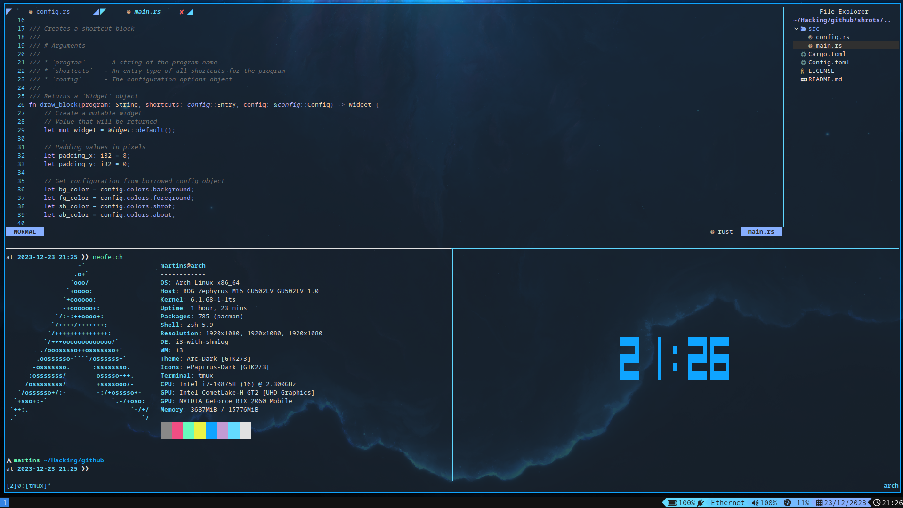
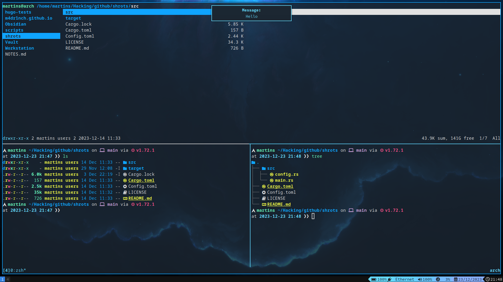

+++
title = "M4dd's DOTFiles"
date = 2023-03-13T21:29:14+02:00
draft = false
tags = ['github', 'other']
summary = 'My linux dotfiles for those who are interested.'
description = 'My linux dotfiles for those who are interested.'
thumbnail = 'img/dt-logo.png' 
+++

# M4dd's DOTFiles
## Overview

Hello, these are my Linux dotfiles. I have been using Linux as a daily driver for about 3 years now... I am currently using Arch but might move to Artix in the future. You can find my dotfiles on [Github](https://github.com/m4dr1nch/dotfiles), enjoy **(◕‿◕✿)**.

Software that I use:
* OS - **Arch (btw)**
* Window manager - **I3VM**
* Terminal emulator - **Alacritty**
* Notification daemon - **Dunst**
* Application launcher - **Rofi**
* Text editor - **Neovim**
* File manager - **Ranger**
* Terminal multiplexer - **Tmux**
* System shell - **ZSH**

## Screenshots

