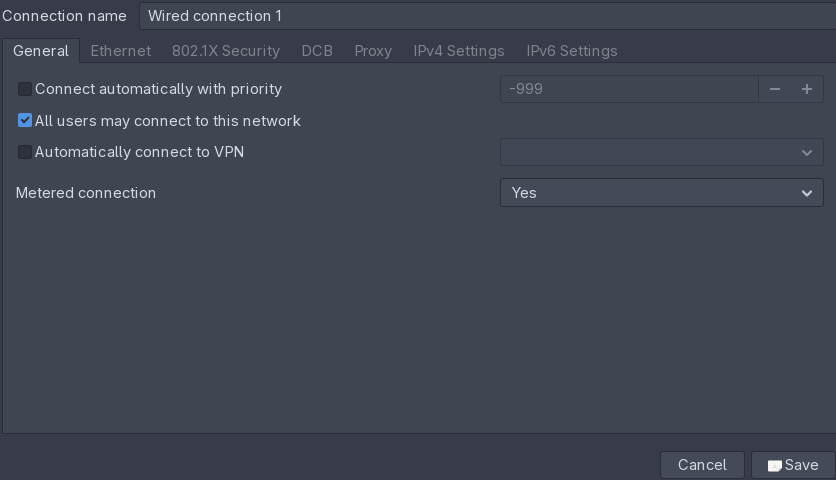
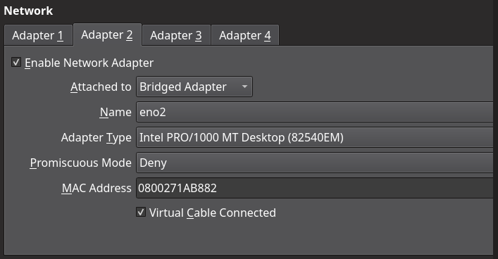
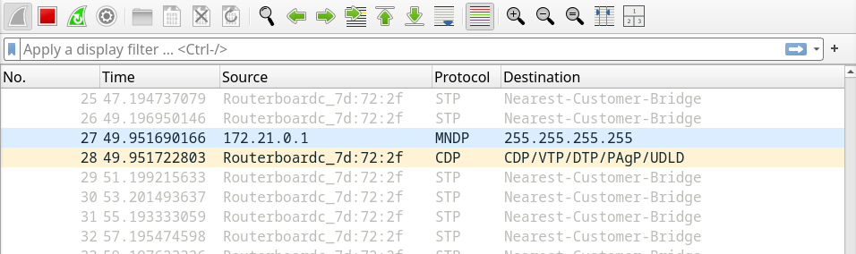
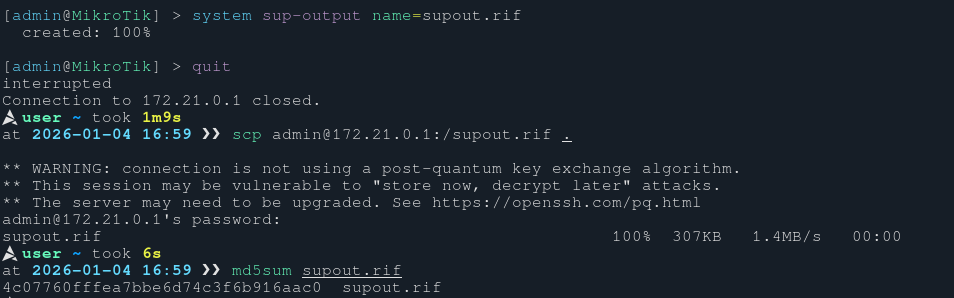

+++
title = 'Live Router Forensics Machine'
date = 2026-01-04T14:03:59+02:00
draft = false 
tags = ['tool', 'special']
description = 'Creating an environment for live router investigation. Extract evidence & leave as little noise as possible.'
summary = 'Creating an environment for live router investigation. The point is to provide methods and ideas of accessing live routers for forensic evidence extraction while leaving as little noise as possible.'
thumbnail = 'img/lrfm-thumbnail.png'
+++

Live Router Forensics Machine
===

Introduction
---

### Why?

Let's say that an on-site forensic investigation of a router is required. There can be meany reasons for this as we do not want to lose any volatile evidence that this router may have. These can be specific configurations i.e. port-forwards, white-listed IPs etc. As there have been cases where threat-actors use self-deleting configurations to avoid any further investigation. One example that I can think of is the feature of Mikrotik routers, where it allows you to execute scripts on start-up (Done via. scheduler). This can be configured in a way where once the device is turned-on (in a lab perhaps) it then does a full factory reset to wipe any evidence.

When performing router evidence acquisition we want to make as little noise as possible. This can only be done with a properly configured acquisition machine. The reason for it is that a regular desktop computers perform various background requests, for example Windows constantly queries updates, sends telemetry etc. Even on Linux hosts, the second you open a browser it looks for updates... Those can off course be turned off, but there can still be many cases where a device will send arbitrary requests. These requests, both HTTP, DNS, and others can quickly pollute the target device.

### Who is this for?

This blog is clearly meant for tech-people... I will not provide any VM files or scripts as those can be easily crafted by yourselves. Also some methods can be a bit tedious and might not be suitable for cases where time is incredibly important (This might be too much to ask for IR cases). These methods can be used in law-enforcement investigations where the acquisition must always stand up in court.

### What are we doing?

In this blog post I will explore the idea of using a Linux virtual machine (With a Linux host) to isolate requests and avoid any unwanted noise. The ideas performed on the guest machine can also be applied to bear-metal devices, it's just that sometimes a separate computer might be to much to carry. Also the use of a VM can allow you to revert-back to a specific snap-shot thus giving you a clean state for other investigations. At the end I'll give an example of acquiring forensic evidence from a **Mikrotik hAP lite** router.

### Setup

In my setup I will be using the following OSes & tools:

- **Arch** host w/ `NetworkManager`.
- **Artix** guest w/ `dinit`, `connmand`, `ufw` (+ a bunch of other network tools).
- **VirtualBox** hypervisor.

Note that the choice of specific Linux distros does not matter. I use ones that I'm familiar with + I thought it might be a cool idea to experiment with **Artix**. For this case it does not have any more benefits that **Arch**, but generally speaking the less software is installed, the less noise the host will make. Also, the actual guest will be fully fire-walled off (At least in layer 7) so using Ubuntu or anything else is enough.

Environment Setup
---

### Host Machine

The host machine setup is very simple. The only thing that needs to be configured is the network settings. The required configuration is to make sure that the target network adapter **does not** have `autoconect` enabled. This will allow us to avoid any noise that the host would normally create. Note that in the configuration covered in this blog post I will be using a wired connection, but the same can be applied to WiFi. Also since PCs normally can have both Ethernet (Or Type-C w/ Ethernet adapter) & WiFi this can allow us to keep the internet connection on the host (Useful for searching doc's or other stuff). For example if acquisition is done via. Ethernet then we would use WiFi for our own internet, and if WiFi is used for acquisition then Ethernet can be used respectively.

Here is the `NetworkManager` configuration for the host machine. The only thing that is changed for `Wired connection 1` is the disabled `Connect automatically with priority`.



One last thing. I recommend installing a packet capture tool on the host OS. I found that network sniffing is best done there. This will allow you to look at the idle network traffic. This info can then be used for configuring static IPs. Also a PCAP file of all actions that were performed is nice for further reference.

### Guest VM

For the guest I installed **Artix** Linux with the `dinit` system. Prior to isolating networking I installed all tools that I might need. Here is the command / list of tools that I included (I also recommend including word-lists for on-the-fly password guessing):

```bash
sudo pacman -Sy python python-virtualenv nmap ettercap \
    bettercap arp-scan openssh macchanger \
    metasploit routersploit aircrack-ng net-tools tcpdump \
    tcpflow thc-ipv6 hydra proxychains-ng bind \
    firefox-esr wireshark-qt ufw-dinit
```

I also recommend setting up VirtualBox guest additions. This is useful for quick evidence extraction from the investigation machine. Remember that the network cannot be used as it will be fully fire-walled. Here is a `dinit` description file for the `VBoxService` (Including this, as at the time of writing there is none).

```ini
type            = process
command         = /usr/bin/VBoxService -f
logfile         = /var/log/dinit/vboxsrv.log
depends-on 	    = elogind
```

Before configuring networking within the guest OS we need to configure VirtualBox. For the network configuration I use two adapters. The NAT adapter for when I want to modify anything that requires an internet connection i.e. installing additional software. And a bridged adapter that points to the hosts Ethernet interface (This is the one that we will be configuring onwards). Here is the VirtualBox configuration.



Next we configure the `connmand` service. First up we need to enable the `OfflineMode` which turns off all interfaces by default. This means that on-boot (and after) there will be no network connections. The configuration is found at `/var/lib/connman/settings`. Note that the wired connection is also disabled but I don't think it matters here, as we are configuring those separately.

```toml
[global]
OfflineMode=true

[Wired]
Enable=false
Tethering=false
Tethering.Freq=2412
```

Next we want to configure the network adapter settings. Here we must pick between a static IP or dynamic one. Usually I setup a static IP and fall back to dynamic if something does not work. We also use the configuration to disable `autoconect` and anything that is related to IPv6. 

The configuration at `/var/lib/connman/ethernet_080027aa354d_cable/settings`.

```toml
[ethernet_080027aa354d_cable]
Name=Wired
AutoConnect=false
Modified=2025-12-14T17:43:21Z
IPv4.method=manual
IPv4.netmask_prefixlen=24
IPv4.local_address=172.21.0.2
IPv6.method=off
IPv6.privacy=disabled
```

For dynamic IP addresses use this:

```toml
[ethernet_080027aa354d_cable]
Name=Wired
AutoConnect=false
Modified=2025-12-14T17:43:21Z
IPv4.method=auto
IPv6.method=off
IPv6.privacy=disabled
```

Note all of this stuff can later be altered with `connmanctl`. Here are some command snippets:

```bash
# Enable ethernet (takes it out of offline mode)
# Make sure the `AutoConnect` is disabled prior
enable ethernet
# Set static IP
config ethernet_080027aa354d_cable ipv4 manual 172.21.0.2 255.255.255.0
# Change to DHCP
config ethernet_080027aa354d_cable ipv4 auto enable
# Connect & disconnect
connect ethernet_080027aa354d_cable
disconnect ethernet_080027aa354d_cable
```

Next we must setup the firewall. The following commands use `dinictl` to start & enable `ufw`. We also block all `incoming` and `outgoing` traffic.

```bash
sudo dinitctl start ufw
sudo dinitctl enable ufw
sudo ufw default deny incoming
sudo ufw default deny outgoing
sudo ufw reload
```

Then whenever we need to allow only connections to a specific IP (The routers IP) or a specific network, we use one of the following commands:

```bash
ufw allow out to 172.21.0.1
ufw allow out to 172.21.0.0/24
```

This about sums up all of the configuration. Once the machine is set up in the required state (Everything primed and ready), I recommend creating a VirtualBox snap-shot.

Next up we'll go through the entire acquisition process of a **Mikrotik hAP lite** router.

Example Mikrotik Acquisition
---

So with the host adapter disconnected, VM power-on, and all of the configuration set we are ready to perform acquisition. First things first, I started the Wireshark instance on the host computer. After which, I connected the Mikrotik router. Here is a sample of the idle traffic.



**STP** from `Routerboard` MAC. Spanning Tree Protocol that avoids network loops. By default router sends Bridge Protocol Data Units every 2 seconds. This keeps track of network changes and sends `hello` regardless if guest device is connected.

**MNDP** packet from router IP to `255.255.255.255`. This is the MikroTik Neighbor Discovery Protocol which sends broadcast pings to discover devices & exchange info for network visibility. Runs on UDP/5678.

**CDP** protocol from `Routerboard` MAC. Cisco Discovery Protocol (Same idea as MNDP).

From the **MNDP** protocol we can find the routers IP address - in this case `172.21.0.1`. The network mask can be guessed as `172.21.0.0/24`.

Next up we can move to the acquisition VM. We must perform the following actions:

1. Stop networking service: `dinitctl stop connmand`.
2. Set config w/ `IPv4.netmask_prefixlen=24` & `IPv4.local_address=172.21.0.2`.
3. Start networking service: `dinitctl start connmand`.
4. Enter the control console: `connmanctl`.
4. Enable Ethernet: `enable ethernet`.
5. Connect the interface: `connect ethernet_0800271ab882_cable`.
6. Verify given IP & exit `connmanctl`.
7. Add FW rule: `ufw allow out to 172.21.0.1`.

Now we can access the router and perform the acquisition. For Mikrotik we can get the support dump (This is non-exhaustive, just an example):

```bash
ssh admin@172.21.0.1
system sup-output name=supout.rif
scp admin@172.21.0.1:/supout.rif .
```



Once the acquisition is complete we can disconnect the device physically. We can then save the Wireshark PCAP for further reference, transfer all of the evidence via. VirtualBox share, and restore to the previous (clean) snap-shot.

Conclusion
---

Soo... that's about it. This is how I do live router evidence acquisition. This way it minimizes evidence loss and all performed actions are neatly packed in a PCAP dump. Take it for what it's worth, good luck on your future adventures!
