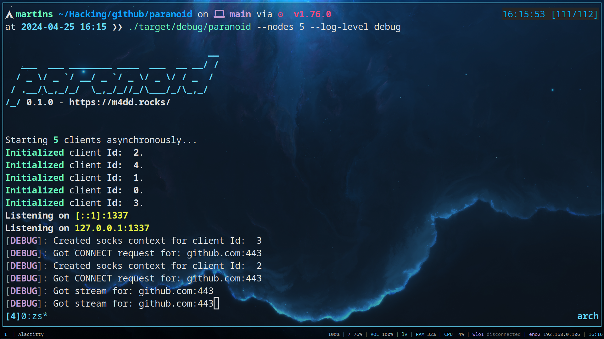
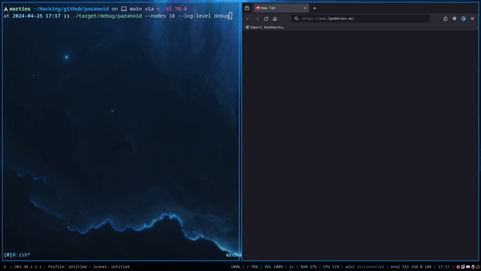

+++
title = 'Paranoid'
date = 2024-04-25T16:45:57+03:00
draft = false 
tags = ['tool', 'github']
summary = 'Paranoid is a TOR based multi-chain proxy, to make deanonymization more difficult.'
description = 'Paranoid is a TOR based multi-chain proxy, to make deanonymization more difficult.'
thumbnail = 'img/pr-thumbnail.png'
+++


Paranoid - TOR Based multichain proxy
======================================




[Paranoid](https://github.com/s4vvi/paranoid) is a TOR based multi-chain proxy, to make deanonymization more difficult. The tool is a more simple implementation of the [DcLabs SPLITTER](https://github.com/renergr1nch/splitter). It is written in **Rust** using the [Arti](https://tpo.pages.torproject.net/core/arti/) project *(Most of the proxy code is ripped from the Arti project & modified)*.

**DISCLAIMER: THIS IS A WORKING PROTOTYPE**

[DcLabs SPLITTER](https://github.com/renergr1nch/splitter) issues that this tool fixes:
- It can be compiled as a standalone binary;
- It does not use docker & other 3rd party software;
- It only opens up a single port;
- Handles all connections internally;
- It's a simple tool that can be incorporated into automation scripts.

How it works:
1. The user defines an arbitrary amount of nodes & other options;
2. Tool spawns multiple TOR chains & opens a SOCKS5 proxy;
3. User creates request to the proxy;
4. The proxy receives every request & picks a random TOR chain;
5. The proxy forwards the request through the chain;
6. Nodes are queued for regeneration with a base interval.



Clone it from github via `git clone https://github.com/s4vvi/paranoid.git` & use `cargo build` to build it. The tool is really simple to use, here is the help menue anyway (`paranoid --help`):
```text
Paranoid usage...

Usage: paranoid [OPTIONS]

Options:
      --host <HOST>
          Host to run on [default: 127.0.0.1]
      --port <PORT>
          Entry port [default: 1337]
      --nodes <NODES>
          Amount of nodes [default: 2]
      --log-level <LOG_LEVEL>
          The log level to use [default: info]
          [possible values: info, warn, error, debug, trace]
      --coffee
          Coffee
      --base-regen-rate <BASE_REGEN_RATE>
          Node automatic regeneration rate.
          Random deviation as added per node [default: 600]
      --max-regen-deviation <MAX_REGEN_DEVIATION>
          Max deviation for random node generation [default: 120]
  -h, --help
          Print help
  -V, --version
          Print version
```
