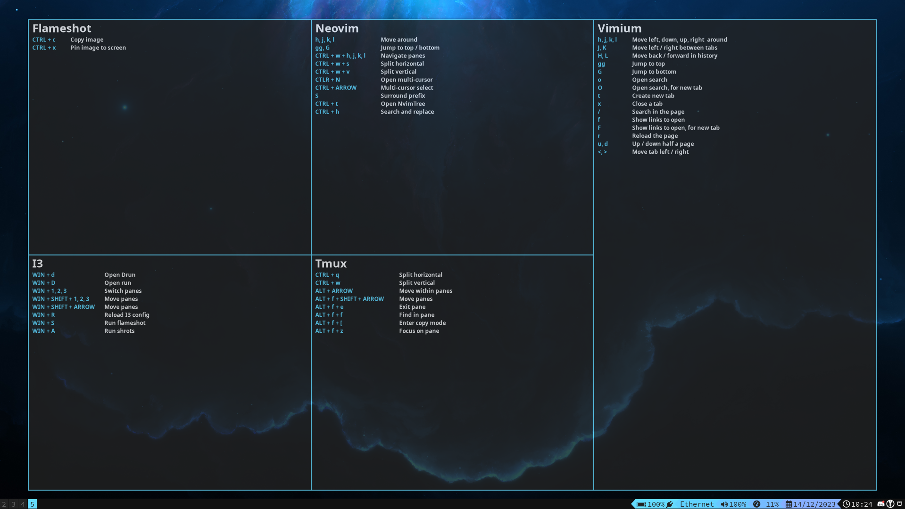

+++
title = 'Shrots'
date = 2023-12-14T21:52:22+02:00
draft = false
tags = ['tool', 'github']
summary = 'A dead simple popup tool for learning shortcuts.'
description = 'A dead simple popup tool for learning shortcuts.'
thumbnail = 'img/sh-thumbnail.png'
+++

Shrots - A Fast Way To Memorize Shortcuts
=========================================

[Shrots](https://github.com/m4dr1nch/shrots) is a dead simple program written in Rust, that shows a prewritten configuration file in the form of a program, shortcuts, and details. This is a great way to memorize shortcuts for tools, as this program can be binded to a shortcut for quick access.

Note that there are a few things to keep in mind before using this program:
- This is the first program I've written in Rust.
- Shrots have only been tested Arch I3VM.
- It's intended to be as simple as possible.
- There are a lot of things that need to be added.
